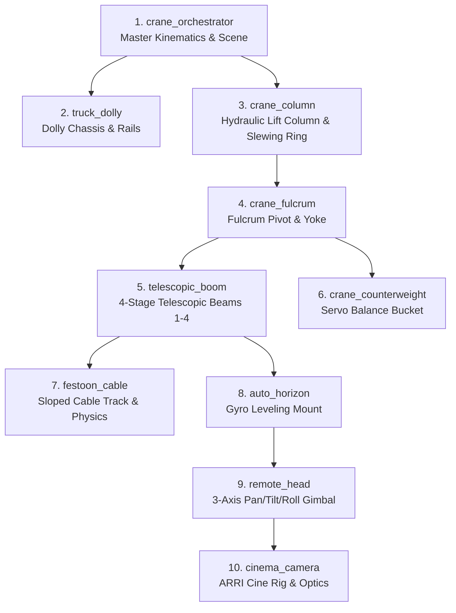

# Supertechno 50 3D Crane – Multi-Agent System (AGENTS.md)

Dieses Dokument definiert das modulare Multi-Agenten-System für die 3D-Simulation und Kinematik des **Supertechno 50 Teleskopkrans**.
Jede physikalische und logische Baugruppe des Krans wird von einem spezialisierten Agenten überwacht und weiterentwickelt.

---

## 🤖 Übersicht der Kran-Spezialagenten

---

## 📋 Komponenten & Agenten-Spezifikationen

### 1. `crane_orchestrator` (Master Kinematics & Scene Orchestrator)
* **Dateien**: [`src/components/Crane.tsx`](file:///e:/3D-headings/src/components/Crane.tsx), [`src/utils/craneKinematics.ts`](file:///e:/3D-headings/src/utils/craneKinematics.ts), [`src/App.tsx`](file:///e:/3D-headings/src/App.tsx)
* **Zuständigkeit**:
  * Gesamtszenen-Management (R3F Canvas, Beleuchtung, Umgebungs-Presets, Kameras).
  * Kinematische Guardrails (`SAFE_FLOOR_CLEARANCE = 0.05m`, `enforceCraneFloorLimits`).
  * Globale Parameter-Synchronisation: `dollyTrack`, `columnLift`, `basePan`, `boomTilt`, `teleExtension`, `headPan`, `headTilt`, `headRoll`.
  * HUD- und Telemetrie-Rendering (Ausfahrlänge, Neigungswinkel, Linsenhöhe über Grund, Bodenabstand).

### 2. `truck_dolly` (Dolly Chassis & Schienen)
* **Dateien**: [`src/components/Truck.tsx`](file:///e:/3D-headings/src/components/Truck.tsx)
* **Zuständigkeit**:
  * Mobiles Chassis, 4x Doppel-Stahl-Schienenräder, Luftreifen für Studiobetrieb.
  * Hydraulische Nivellierstützen (Outriggers) und Wasserwaagen-Anzeigen.
  * Schienenführung (`CraneDollyRailTrack`), Schienenlänge, Anschlagpuffer.

### 3. `crane_column` (Hubsäule & Schwenklager)
* **Dateien**: [`src/components/CraneColumnAssembly.tsx`](file:///e:/3D-headings/src/components/CraneColumnAssembly.tsx)
* **Zuständigkeit**:
  * Teleskopierbare hydraulische Hubsäule (Zylinderstufe 1 & 2).
  * 360° Kugeldrehverbindung (Base Pan Slewing Ring).
  * Hubkinematik-Grenzen (`getMinColumnElevationForPose`, `clampColumnElevation`).

### 4. `crane_fulcrum` (Fulcrum / Hauptgelenk & Yoke)
* **Dateien**: [`src/components/CraneFulcrumAssembly.tsx`](file:///e:/3D-headings/src/components/CraneFulcrumAssembly.tsx)
* **Zuständigkeit**:
  * Hauptlager-Gabel (Yoke) aus eloxiertem Aluminium/Stahl.
  * Neigeachse (`boomTilt`), Dämpferzylinder, Drehwinkel-Encoder.
  * Mechanische Endanschläge (-45° bis +60°).

### 5. `telescopic_boom` (Teleskop-Ausleger Beams 1-4)
* **Dateien**: [`src/components/CraneTennis.tsx`](file:///e:/3D-headings/src/components/CraneTennis.tsx), [`src/model/Supertechno50FBXModel.ts`](file:///e:/3D-headings/src/model/Supertechno50FBXModel.ts)
* **Zuständigkeit**:
  * 4-stufiger synchroner Teleskoparm (Beam 1 außen bis Beam 4 innen + Nase).
  * Interne Edelstahl-Antriebsseile, Umlenkrollen, spielfreie Linearführungen.
  * Ausfahrbereich: 0.0 m bis ~11.5 m (maximale Gesamtreichweite ~15.2 m).

### 6. `crane_counterweight` (Gegengewicht & Massenbalance)
* **Dateien**: [`src/components/CraneCounterweight.tsx`](file:///e:/3D-headings/src/components/CraneCounterweight.tsx)
* **Zuständigkeit**:
  * Heck-Gegengewichtswagen mit Bleigewichten und Spindelantrieb.
  * Automatische synchrone Massenkompensation bei Ausfahren des Teleskoparms.
  * Heck-Bodenkollisionsüberwachung (`getRearLowestY`).

### 7. `festoon_cable` (Schleppkabel & Festoon-Dynamik)
* **Dateien**: [`src/components/SlopeCable.tsx`](file:///e:/3D-headings/src/components/SlopeCable.tsx), `CraneFestoonCable` in [`src/components/Crane.tsx`](file:///e:/3D-headings/src/components/Crane.tsx)
* **Zuständigkeit**:
  * Geneigte Kabelführung (Festoon Track) entlang der Teleskopstufen.
  * Dynamische Katenoid-/Bézier-Durchhangsberechnung (`sagFactor`, Schlaufenanzahl).
  * PBR-Kabelmaterialien (schwarzer Mattgummi, Kupfer/Stahl-Geflecht, farbige SDI-Leitungen).

### 8. `auto_horizon` (Auto-Horizon Nivellierung)
* **Dateien**: [`src/components/AutoHorizonMount.tsx`](file:///e:/3D-headings/src/components/AutoHorizonMount.tsx)
* **Zuständigkeit**:
  * Frontflansch mit "Supertechno"-Lasergravur.
  * Elektronischer Gyro-Horizontausgleich (2-Achs Neigungs- & Rollkompensation).
  * Standardisierte Mitchell-Mount-Basis mit Schlossmutter.

### 9. `remote_head` (3-Achs Remote Camera Head)
* **Dateien**: [`src/components/RemoteCameraHead.tsx`](file:///e:/3D-headings/src/components/RemoteCameraHead.tsx)
* **Zuständigkeit**:
  * 3-Achsen Gimbal (Pan, Tilt, Roll) mit Brushless-Direktantrieben.
  * Optische Absolutwertgeber, Schleifringe für kontinuierliche 360°-Drehungen.
  * Kamerawippe mit Dovetail-Schnellwechselplatte.

### 10. `cinema_camera` (ARRI Cinema Kamera Rig)
* **Dateien**: [`src/components/ArriCinemaCamera.tsx`](file:///e:/3D-headings/src/components/ArriCinemaCamera.tsx)
* **Zuständigkeit**:
  * ARRI Alexa Mini LF Kameragehäuse mit Cine-Objektiv und Antireflex-Frontlinse.
  * Carbon-Rohre (15mm/19mm), Cforce-Motoren für Focus/Iris/Zoom, Mattebox mit Flags.
  * Funk-Bildsender (Teradek), V-Mount Akkus und Sensorebenen-Projektion.

---

## ⚡ Workflow-Protokoll

Jede Modifikation an einer Kran-Komponente wird vom jeweiligen Spezial-Agenten ausgeführt und anschließend vom `crane_orchestrator` validiert:
1. **Komponenten-Isolierung**: Änderungen an Geometrie/Shader/Physik werden in der zuständigen Datei durchgeführt.
2. **Kinematik-Konsistenz**: Keine Komponente darf die definierten mechanischen Grenzwerte verletzen.
3. **Boden- & Kollisionsschutz**: Der Sicherheitsabstand (`SAFE_FLOOR_CLEARANCE`) bleibt unter allen Neigungs- und Hubkonfigurationen garantiert.
