# Supertechno 50 3D Crane – Multi-Agent System (AGENTS.md)

Dieses Dokument definiert das modulare Multi-Agenten-System für die 3D-Simulation und Kinematik des **Supertechno 50 Teleskopkrans**.
Jede physikalische und logische Baugruppe des Krans wird von einem spezialisierten Agenten überwacht und weiterentwickelt.

---

## 🤖 Übersicht der Spezial- & Master-Agenten

```mermaid
graph TD
    Orchestrator[1. crane_orchestrator<br/>Master Kinematics & Scene] --> Dolly[2. crane_dolly<br/>Crane Dolly Chassis & Rails]
    Orchestrator --> Column[3. crane_column<br/>Hydraulic Lift Column & Slewing Ring]
    Column --> Fulcrum[4. crane_fulcrum<br/>Fulcrum Pivot & Yoke]
    Fulcrum --> Boom[5. telescopic_boom<br/>4-Stage Telescopic Beams 1-4]
    Fulcrum --> Counterweight[6. crane_counterweight<br/>Servo Balance Bucket]
    Boom --> Festoon[7. festoon_cable<br/>Sloped Cable Track & Physics]
    Boom --> Horizon[8. auto_horizon<br/>Gyro Leveling Mount]
    Horizon --> Head[9. remote_head<br/>3-Axis Pan/Tilt/Roll Gimbal]
    Head --> Camera[10. cinema_camera<br/>ARRI Cine Rig & Optics]
    Orchestrator --> Scenery[11. scene_environment<br/>3D Scenery, Lighting & Ground]
    Orchestrator --> Operator[12. crane_operator<br/>Human Operator Rig & Two-Man Crew]
    Orchestrator --> Tennis[13. crane_tennis<br/>Dual-Crane Match & Court Arena]
    Orchestrator --> Desk[14. control_desk<br/>Flightcase Master Console, Rear Controls & Protocol]
    Orchestrator --> TennisKinematics[15. tennis_kinematics<br/>Tennis IK, Ballistics & Stroke Dynamics]
    TennisKinematics --> Tennis
    Tennis --> Racket[16. tennis_racket<br/>Carbon Racket & Gimbal Head]
    Tennis --> Scoreboard[17. tennis_scoreboard<br/>ATP Scoreboard HUD, 3D Stadium LED & Graphics]
    Tennis --> TennisEmotions[18. tennis_emotions<br/>Player Psychology, Celebrations & Drama]
    Orchestrator --> Architect[19. software_architect<br/>Architecture, R3F Performance & Governance]
    Orchestrator --> Director[20. camera_director<br/>Automated Cinematography & Broadcast Regie]
    Tennis --> BallDeployment[21. ball_crane_deployment<br/>Tennis Ball Deployment, Hopper & Cannon Launcher]
    Orchestrator --> LKW[22. man_tgl_truck<br/>🚚 LKW Logistics & Transport Master]
    
    subgraph LKW_Subsystem [🚚 MAN TGL 12.250 Subagenten-Ökosystem]
        LKW --> Cabin[22.1 truck_cabin<br/>Fahrerkabine, Cockpit, Türen & MAN Grill]
        LKW --> Chassis[22.2 truck_chassis<br/>Leiterrahmen, D08 Antrieb, Tank & Unterfahrschutz]
        LKW --> BoxBody[22.3 truck_box_body<br/>Kofferaufbau, Plywood-Panels & Ladebordwand]
        LKW --> Wheels[22.4 truck_wheels_suspension<br/>265/70R17.5 Räder, Radkästen & Einstieg]
        LKW --> Cargo[22.5 truck_crane_cargo<br/>Supertechno 50 Ladungssicherung & Flightcases]
        LKW --> Telematics[22.6 truck_telematics_physics<br/>Fahrdynamik, Spotlights, HUD & BSOD]
        LKW --> Wipers[22.7 truck_windshield_wipers<br/>🌧️ Windschutzscheibe & Wischerkinematik]
        LKW --> Plate[22.8 truck_license_plate<br/>🪪 Nummernschild & SUPERTECHNO Branding]
        LKW --> Doors[22.9 truck_doors_kinematics<br/>🚪 Fahrertüren, Innenverkleidung & Kinematik]
        LKW --> Tailgate[22.10 truck_tailgate_kinematics<br/>📦 Ladebordwand, Heckklappe & Hubkinematik]
        LKW --> WheelArch[22.11 truck_front_wheel_arch<br/>🛞 Vordere Radkästen, Einstiegsstufen & Blinker]
        LKW --> RearLights[22.12 truck_rear_lights<br/>🚨 Heckleuchten-Cluster, Bremslicht & Blinker]
        LKW --> Headlights[22.13 truck_headlights<br/>💡 LED-Frontscheinwerfer, DRL & Nebellampen]
        LKW --> Tracks[22.14 truck_race_tracks<br/>🏎️ Silverstone GP, Rennstrecken & FIA Kerbs]
    end
```

---

## 📋 Komponenten & Agenten-Spezifikationen

### 1. `crane_orchestrator` (Master Kinematics & Scene Orchestrator)
* **Dateien**: [`src/components/Crane.tsx`](file:///e:/3D-headings/src/components/Crane.tsx), [`src/utils/craneKinematics.ts`](file:///e:/3D-headings/src/utils/craneKinematics.ts), [`src/App.tsx`](file:///e:/3D-headings/src/App.tsx)
* **Zuständigkeit**:
  * Gesamtszenen-Management (R3F Canvas, Beleuchtung, Umgebungs-Presets, Kameras).
  * Kinematische Guardrails (`SAFE_FLOOR_CLEARANCE = 0.05m`, `enforceCraneFloorLimits`).
  * Globale Parameter-Synchronisation: `dollyTrack`, `columnLift`, `basePan`, `boomTilt`, `teleExtension`, `headPan`, `headTilt`, `headRoll`.
  * HUD- und Telemetrie-Rendering (Ausfahrlänge, Neigungswinkel, Linsenhöhe über Grund, Bodenabstand).

### 2. `crane_dolly` (Kran-Dolly Chassis, Schienen & Outriggers)
* **Dateien**: [`src/components/Crane.tsx`](file:///e:/3D-headings/src/components/Crane.tsx), [`src/components/tennis/TennisMountedRig.tsx`](file:///e:/3D-headings/src/components/tennis/TennisMountedRig.tsx)
* **Zuständigkeit**:
  * Mobiles Kran-Chassis, 4x Doppel-Stahl-Schienenräder, Luftreifen für Studiobetrieb.
  * Hydraulische Nivellierstützen (Outriggers) und Wasserwaagen-Anzeigen.
  * Schienenführung (`CraneDollyRailTrack`), Schienenlänge, Anschlagpuffer.

### 3. `crane_column` (Hubsäule & Schwenklager)
* **Dateien**: [`src/components/CraneColumnAssembly.tsx`](file:///e:/3D-headings/src/components/CraneColumnAssembly.tsx)
* **Zuständigkeit**:
  * Teleskopierbare hydraulische Hubsäule (Zylinderstufe 1 & 2).
  * 360° Kugeldrehverbindung (Base Pan Slewing Ring).
  * Hubkinematik-Grenzen (`getMinColumnElevationForPose`, `clampColumnElevation`).

### 4. `crane_fulcrum` (Fulcrum / Hauptgelenk & Yoke)
* **Dateien**: [`src/components/CraneFulcrumAssembly.tsx`](file:///e:/3D-headings/src/components/CraneFulcrumAssembly.tsx)
* **Zuständigkeit**:
  * Hauptlager-Gabel (Yoke) aus eloxiertem Aluminium/Stahl.
  * Neigeachse (`boomTilt`), Dämpferzylinder, Drehwinkel-Encoder.
  * Mechanische Endanschläge (-45° bis +60°).

### 5. `telescopic_boom` (Teleskop-Ausleger Beams 1-4)
* **Dateien**: [`src/components/Crane.tsx`](file:///e:/3D-headings/src/components/Crane.tsx), [`src/model/Supertechno50FBXModel.ts`](file:///e:/3D-headings/src/model/Supertechno50FBXModel.ts)
* **Zuständigkeit**:
  * 4-stufiger synchroner Teleskoparm (Beam 1 außen bis Beam 4 innen + Nase).
  * Interne Edelstahl-Antriebsseile, Umlenkrollen, spielfreie Linearführungen.
  * Ausfahrbereich: 0.0 m bis ~11.5 m (maximale Gesamtreichweite ~15.2 m).

### 6. `crane_counterweight` (Gegengewicht & Massenbalance)
* **Dateien**: [`src/components/CraneCounterweight.tsx`](file:///e:/3D-headings/src/components/CraneCounterweight.tsx)
* **Zuständigkeit**:
  * Heck-Gegengewichtswagen mit Bleigewichten und Spindelantrieb.
  * Automatische synchrone Massenkompensation bei Ausfahren des Teleskoparms.
  * Heck-Bodenkollisionsüberwachung (`getRearLowestY`).
  * Endanschlag und Führungsschienenbereich ($z = -1.08\,\text{m}$ bis $+3.48\,\text{m}$, Schlittenfahrt $z = -0.80\,\text{m}$ bis $+3.28\,\text{m}$).

### 7. `festoon_cable` (Schleppkabel & Festoon-Dynamik)
* **Dateien**: [`src/components/SlopeCable.tsx`](file:///e:/3D-headings/src/components/SlopeCable.tsx), `CraneFestoonCable` in [`src/components/Crane.tsx`](file:///e:/3D-headings/src/components/Crane.tsx)
* **Zuständigkeit**:
  * Geneigte Kabelführung (Festoon Track) entlang der Teleskopstufen.
  * Dynamische Katenoid-/Bézier-Durchhangsberechnung (`sagFactor`, Schlaufenanzahl).
  * PBR-Kabelmaterialien (schwarzer Mattgummi, Kupfer/Stahl-Geflecht, farbige SDI-Leitungen).
  * **Kabel-Startregel (Supremacy / Guardrail)**: Das Schleppkabel und dessen Führungsschiene dürfen IMMER erst NACH den Gegengewichten beginnen (in Ausfahrrichtung des Auslegers, $z \le -1.18\,\text{m}$), sodass Kabel und Verfahrweg des Gegengewichtswagens vollständig kollisionsfrei getrennt sind.

### 8. `auto_horizon` (Auto-Horizon Nivellierung)
* **Dateien**: [`src/components/AutoHorizonMount.tsx`](file:///e:/3D-headings/src/components/AutoHorizonMount.tsx)
* **Zuständigkeit**:
  * Frontflansch mit "Supertechno"-Lasergravur.
  * Elektronischer Gyro-Horizontausgleich (2-Achs Neigungs- & Rollkompensation).
  * Standardisierte Mitchell-Mount-Basis mit Schlossmutter.

### 9. `remote_head` (3-Achs Remote Camera Head)
* **Dateien**: [`src/components/RemoteCameraHead.tsx`](file:///e:/3D-headings/src/components/RemoteCameraHead.tsx)
* **Zuständigkeit**:
  * 3-Achsen Gimbal (Pan, Tilt, Roll) mit Brushless-Direktantrieben.
  * Optische Absolutwertgeber, Schleifringe für kontinuierliche 360°-Drehungen.
  * Kamerawippe mit Dovetail-Schnellwechselplatte.

### 10. `cinema_camera` (ARRI Cinema Kamera Rig)
* **Dateien**: [`src/components/ArriCinemaCamera.tsx`](file:///e:/3D-headings/src/components/ArriCinemaCamera.tsx)
* **Zuständigkeit**:
  * ARRI Alexa Mini LF Kameragehäuse mit Cine-Objektiv und Antireflex-Frontlinse.
  * Carbon-Rohre (15mm/19mm), Cforce-Motoren für Focus/Iris/Zoom, Mattebox mit Flags.
  * Funk-Bildsender (Teradek), V-Mount Akkus und Sensorebenen-Projektion.

### 11. `scene_environment` (3D Scenery, Environment & Ground Manager)
* **Dateien**: [`src/components/CraneScenery.tsx`](file:///e:/3D-headings/src/components/CraneScenery.tsx), [`src/components/Crane.tsx`](file:///e:/3D-headings/src/components/Crane.tsx)
* **Zuständigkeit**:
  * Helle & dunkle 3D-Standorte: Heller Platz & Pyramiden (`bright_concrete`), Gizeh Pyramiden Wüste (`pyramids`), Machu Picchu Inka-Anden (`machu_picchu`), Helle Sommerwiese (`bright_meadow`), High-Key Studio (`bright_studio`), Grüne Wiese (`meadow`), Industrie-Beton (`concrete`), Seeufer (`lake`), Dark Studio (`studio`).
  * 3D-Hintergrund-Monumente: Monumentale Pyramiden von Gizeh (Cheops, Chephren, Mykerinos, Sphinx), Inka-Zitadelle Machu Picchu (Zuckerhut-Gipfel Huayna Picchu, Andenes-Terrassen, Sonnentempel, Intihuatana, Inka-Steinhäuser und grasende Lamas).
  * Fotorealistische Sonnen- und Himmelsausleuchtung, Sky-Fill-Lichter, Kontakt- & Weichschatten, atmosphärischer SkyDome mit Wolkendynamik.
  * Prozedurale PBR-Bodentexturen (Sichtbeton, Wüstensand-Rippeln, Andengras, Grasnarben, Wildblumen, Steine, Holzdielen, Poller, Schiffscontainer).
  * Synchronisation von Hintergrundfarben und HDRI-Presets (`city`, `park`, `studio`, `sunset`).

### 12. `crane_operator` (Film Set Two-Operator Crew & Controls Master)
* **Dateien**: [`src/components/CraneOperator.tsx`](file:///e:/3D-headings/src/components/CraneOperator.tsx), [`src/components/Crane.tsx`](file:///e:/3D-headings/src/components/Crane.tsx)
* **Zuständigkeit**:
  * **1. Heck-Kranführer (Rear Crane Operator)**:
    * 3D-Charakter-Rig mit Vintage "SUPERTECHNO CINE CRANE OPS" Trucker-Cap, Salt-&-Pepper Haar/Vollbart, In-Ear-Akustik-Spiralschlauch, Outdoor-Setjacke und Grip-Handschuhen.
    * Steht direkt am Heck-Steuerpult hinter den Gegengewichten ($X=0\,\text{m}, Z=\text{dollyTrack}+4.1\,\text{m}$).
    * Live-Synchronisation der goldenen Fluid-Handräder (`basePan`, `boomTilt`) und des Teleskop-Joysticks (`teleExtension`).
    * Dynamisches Kopf-Tracking (schaut hinauf zur Kranspitze / Linsenhöhe).
    * Kamera-Fokus & Close-Up-Zoom (`case 'operator'`).
  * **2. DoP / Remote-Head Operator am Bodenpult (Floor Desk Operator)**:
    * 3D-Charakter-Rig mit Film-Crew Hoodie/Shirt ("TECHNOCRANE HEAD & MOCO OPERATOR"), Pro Cine-Headset mit Boom-Mikrofon.
    * Steht am separaten Flightcase-Bodensteuerpult neben der Schiene ($X=3.2\,\text{m}, Z=\text{dollyTrack}+0.8\,\text{m}$).
    * Steuert 3x Master Wheels (`headPan`, `headTilt`, `headRoll`) und FIZ-Kamerasteuerung.
    * Flightcase-Steuerpult mit Stativ, 17" ARRI Live-Master-Monitor (Frame Guides, Waveform, TC), 7" Zusatzmonitor und Snake-Bodenkabel.
    * Kamera-Fokus & Close-Up-Zoom (`case 'desk'`).
  * **3. Synchronisierte Walk-In/Walk-Out-Kinematik**:
    * Beide Operatoren laufen bei Aktivierung zeitgleich von ihren Staging-Positionen flüssig an ihre jeweiligen Pulte und verlassen diese bei Deaktivierung.

### 13. `crane_tennis` (Dual-Crane Tennis Match, Arena & Broadcast Director)
* **Dateien**: 
  * [`src/components/CraneTennis.tsx`](file:///e:/3D-headings/src/components/CraneTennis.tsx) (Scene Orchestrator)
  * [`src/components/tennis/TennisArena.tsx`](file:///e:/3D-headings/src/components/tennis/TennisArena.tsx) (Grand Slam Arena, PBR-Beläge & Netz)
  * [`src/components/tennis/TennisStaffAndCrowd.tsx`](file:///e:/3D-headings/src/components/tennis/TennisStaffAndCrowd.tsx) (Umpire, Ballkinder, Linienrichter & Tribünen-Zuschauer)
  * [`src/components/tennis/TennisMountedRig.tsx`](file:///e:/3D-headings/src/components/tennis/TennisMountedRig.tsx) (Dolly & FBX Crane Mount)
  * [`src/components/tennis/TennisControlDrawer.tsx`](file:///e:/3D-headings/src/components/tennis/TennisControlDrawer.tsx) (2D DOM Schlag- & Einstellungs-Drawer)
  * [`src/components/tennis/TennisUmpireCallWindow.tsx`](file:///e:/3D-headings/src/components/tennis/TennisUmpireCallWindow.tsx) (2D DOM Schiedsrichter-Fenster)
  * [`src/hooks/useTennisMatchEngine.ts`](file:///e:/3D-headings/src/hooks/useTennisMatchEngine.ts) (Tennis Match State Machine Hook)
  * [`src/materials/craneMaterials.ts`](file:///e:/3D-headings/src/materials/craneMaterials.ts) (Zentrale PBR Material & Textur-Registry)
* **Zuständigkeit**:
  * **Dual-Kran Match Kinematik**: 2 synchrone Supertechno 50 Kräne auf parallelen Grundlinien-Schienen ($Z = -15.2\,\text{m}$ und $+15.2\,\text{m}$) mit dynamischer Inverse Kinematik (IK) für Vorhand, Rückhand, Slice, Topspin, 228 km/h Power-Aufschläge sowie **248 km/h Monster-Smashes & Netz-Volleys** direkt am Netz ($Z \approx \pm 1.8\,\text{m} \dots \pm 3.8\,\text{m}$, Auslegervorschub bis zu 11.2m).
  * **Carbon-Tennisschläger als Kamera-Payload (`CraneTennisRacket`)**: In diesem Tennis-View ist die Kamera im Remote Head der Tennisschläger selbst (`customPayload` in `RemoteCameraHead`). Der Kohlefaser-Schlägerkopf sitzt direkt auf dem Gimbal-Kameraträger mit Gitterbespannung, Griffband, kinetischem Saiten-Glow und Partikel-Burst am Sweet Spot.
  * **Ball-Physik & Flugkurven-Engine (`RallyShot`)**: 3D parabolische Trajektorien, Netzhöhenberechnung ($Y_{\text{net}} \approx 1.3 - 11.2\,\text{m}$), **1. & 2. Aufschlag-Dynamik mit Ball-Dribbelphase am Boden**, Schiedsrichter-Faults und realistischer Pause vor dem 2. Service, **10.5m Topspin-Lob Winner** über den Ausleger am Netz, **11.2m hohe defensive Sky-Notkerze** mit Schmetterball-Abschlag, **authentische Netzfehler (`isNetError`) mit Abprall an der Netzkante und Bodenfall an der Netzbasis**, **Out-Bälle (`isOutError`)** und **Netzroller-Drama (`isNetCord`)**, Ball-Smash-Glow, Plasma-Doppelring-Boden-Schockwellen (`smashBurst`) und explosive Rebound-Kicks über die Stadionwand.
  * **World #1 vs World #2 Match Simulation & H2H Engine**: Reales ATP-Finale zwischen 🇮🇹 **[1] Jannik Sinner** (132 km/h Rückhand-Laser, 234 km/h Flat-Aufschlag) und 🇪🇸 **[2] Carlos Alcaraz** (3.200 RPM Heavy Topspin, Disguised Stoppbälle, 248 km/h Smashes) mit offiziellem H2H-Stats-Modal (Alcaraz führt 10–7, Fehlerquoten: ~32% Unforced/Forced Errors).
  * **Grand Slam Match Engine & Schiedsrichter (`TennisUmpire`, `MatchScore`)**: Vollständiges Tennis-Punktesystem (Love, 15, 30, 40, Deuce, Advantage, Game, Set, Tiebreak) mit 3D-animiertem Chair Umpire (Live-Kopf-Tracking und akustisch-visuelle Durchsagen).
  * **Courtside Staff & Tribünen-Atmosphäre**: 4x Ballkinder, 6x Linienrichter mit Signalflaggen, Grand-Stand Tribünen mit 3D-Zuschauern und La-Ola-Jubel.
  * **Grand Slam Court Arena (`TennisCourtArena`)**: 4 umschaltbare PBR-Beläge (Sandplatz/Clay, Rasen/Grass, Hartplatz/Hardcourt, Cyber Neon/Cyber), weiße Markierungslinien, Turniertennisnetz mit Pfosten, LED-Sponsorbanden und 4x Flutlichtmasten.
  * **TV Broadcast Regie & Scoreboard (`TennisCameraMode`)**: 8 dynamische Kameraperspektiven (`broadcast`, `smash` [exklusive First-Person Tennisschläger-Kamera], `ball`, `crane1`, `umpire`, `spectator`, `coach`, `free`) und TV-Grafik-Scoreboard mit Radar-Geschwindigkeitsanzeige, `🔥 248 km/h SMASH`-, `⚡ NETZ-VOLLEY`-, `🕸️ NETZFEHLER`- und `⚠️ OUT`-Status-Badges.
  * **Emotionen & Körpersprache zwischen den Ballwechseln (`celebrationTimerRef`)**: 2.4s authentische Gesten nach jedem Punkt: 🇮🇹 Sinner mit ruhigem, fokussiertem Nicken & Steely Fist, 🇪🇸 Alcaraz mit explosivem 34° Vamos-Ausleger, Faustpumpen und 360° Racket-Twirl; Verlierer mit ungläubigem links-rechts Kopfschütteln & Blick zum Himmel; Vor-Aufschlag-Rituale mit Ball-Dribbeln, Saitenzupfen und Receiver im federnden Ready-Stance.

### 14. `control_desk` (Flightcase Master Console, Rear Controls & Protocol Engine)
* **Dateien**: [`src/model/ControlDeskModel.js`](file:///e:/3D-headings/src/model/ControlDeskModel.js), [`src/components/CraneOperator.tsx`](file:///e:/3D-headings/src/components/CraneOperator.tsx), [`src/components/CraneCounterweight.tsx`](file:///e:/3D-headings/src/components/CraneCounterweight.tsx), [`src/utils/technocraneProtocol.ts`](file:///e:/3D-headings/src/utils/technocraneProtocol.ts), [`src/components/TechnocraneStudio.tsx`](file:///e:/3D-headings/src/components/TechnocraneStudio.tsx)
* **Zuständigkeit**:
  * **1. Boden-Steuerpult (Flightcase Master Console & Dual Displays)**:
    * Robustes Studio-Flightcase-Chassis auf arretierbarem C-Stand / Studio-Dreibeinstativ mit Aluminium-Schutzkanten und Kugelecken.
    * 3x Master Wheels (Pan, Tilt, Roll) mit Messing/Gold-Finish, 1:1 Winkelübertragung, einstellbarem Getriebe-Übersetzungsverhältnis und Fluid-Dämpfung.
    * 17" ARRI Cine Master Viewfinder-Monitor (mit dynamischem 1024x576 Canvas, Frame Guides 2.39:1 / 16:9, False Color Exposure Waveform, Live FPS, Shutter Angle, Sensor-Gain / ISO und SMPTE Timecode).
    * 7" Supertechno 50 Live-Telemetrie-Monitor (Live-Ausfahrlänge $0.0 - 11.5\,\text{m}$, Neigungswinkel $-45^\circ \dots +60^\circ$, Linsenhöhe über Grund, Bodenabstand `frontLowestY` / `rearLowestY`, Hubhöhe, Pan-Winkel und optischer Kollisionswarnung).
    * FIZ-Handeinheit (Focus / Iris / Zoom Controller) und flexible Floor Cable Snake (Multicore-Bodenkabel zum Dolly).
  * **2. Heck-Steuerpult (Rear Crane Controls am Gegengewichtsbügel)**:
    * Ergonomischer Doppel-Henkel-Steuerbügel mit griffsicheren Gummimanschetten (Rubber Grips) auf Hüft-/Brusthöhe ($Z = -3.74\,\text{m}$).
    * Taktiler Wippschalter (Telescopic Rocker Switch) für feinfühliges synchrones Ein- und Ausfahren des Auslegers.
    * Not-Aus-Schlagtaster (Red E-Stop Mushroom Button) mit mechanischer Verriegelung.
    * Goldene Fluid-Handräder für manuelle Base-Pan- und Boom-Tilt-Führung bei Live-Action.
  * **3. Technocrane CGI & MoCo Protocol Engine**:
    * SMPTE Timecode-Synchronisation (`HH:MM:SS:FF`) bei 24, 25, 29.97, 30, 50 und 60 fps.
    * Technocrane ASCII- & UDP-Paketprotokoll (Header `0x7F7A5AA5`, 6-DOF Cartesian Pose, Polar Coordinates, Lens FIZ Data).
    * Motion Control (MoCo) Keyframe-Interpolation (Cubic Hermite / Catmull-Rom Splines), Shot-Presets (`Matrix Bullet-Time`, `Vertigo Dolly-Zoom`, `Low-to-High Hero Rise`) und Export/Import von Tracking-Daten für Unreal Engine, Maya und Disguise.

### 15. `tennis_kinematics` (Tennis Ballistics, Inverse Kinematics (IK) & Stroke Dynamics Engine)
* **Dateien**: [`src/utils/tennisKinematics.ts`](file:///e:/3D-headings/src/utils/tennisKinematics.ts), [`src/components/CraneTennis.tsx`](file:///e:/3D-headings/src/components/CraneTennis.tsx), [`src/components/CraneTennisRacketHead.tsx`](file:///e:/3D-headings/src/components/CraneTennisRacketHead.tsx)
* **Zuständigkeit**:
  * **1. Inverse Kinematik (IK) Solver für Tennis-Schläge**:
    * 6-DOF Zielpose-Berechnung für beide Supertechno 50 Kräne auf den parallelen Schienen ($Z = \pm 15.2\,\text{m}$): Dolly-Track ($X \in [-7.5, 7.5]\,\text{m}$), Hubsäule ($Y \in [1.54, 3.63]\,\text{m}$), Ausfahrlänge ($L_{\text{tele}} \in [0.0, 11.3]\,\text{m}$), Neigungswinkel ($\theta_{\text{tilt}} \in [-45^\circ, +60^\circ]$) und Schwenkwinkel ($\phi_{\text{pan}} \in 360^\circ$).
    * Spezialisierte IK-Zielberechnungen für Vorhand, Rückhand, Topspin, Slice, 228 km/h Flat-Aufschläge, Kick-Serves, Netz-Volleys, 248 km/h Monster-Smashes und 10.5m Topspin-Lobs.
  * **2. Remote Head Racket Biomechanik & Orientierung**:
    * Dynamische 3-Achsen Gimbal-Winkel ($\alpha_{\text{pan}}, \beta_{\text{tilt}}, \gamma_{\text{roll}}$) zur Simulation authentischer Schlagmechanik:
      * **Aufschlag**: Ballwurf-Vorbereitung $\to$ Trophy-Stance ($\beta = +48^\circ$) $\to$ Explosive Pronations-Snap-Phase ($\beta = -42^\circ, \gamma = \pm 65^\circ$) $\to$ Ausschwung.
      * **Groundstrokes**: Ausholphase mit geschlossenem Schlägerblatt $\to$ Treffpunkt-Beschleunigung am Sweet Spot $\to$ Topspin-Wischbewegung nach oben/vorne ($\beta = -18^\circ, \gamma = \mp 45^\circ$) bzw. Slice-Unterschnitt ($\beta = +16^\circ, \gamma = \pm 50^\circ$).
      * **Smash**: Vertikale Streckung $\to$ Handgelenksschnappen über Kopf nach unten.
  * **3. Aerodynamische 3D-Ballistik & Trajektorien-Engine**:
    * 3D parabolische Projektilbahnen mit Spin-Modellierung (Magnus-Effekt: Topspin-Absenkung bei bis zu 3.400 RPM, Slice-Auftrieb, Kick-Serve-Seitenversatz).
    * Physikalischer Netzkanten-Treffer (`isNetCord` mit Netzkanten-Verzögerung), Netzfehler (`isNetError` mit Abprall und Ausrollen an der Netzbasis), Rebound-Elastizität und Bodenaufprall-Schockwellen.
  * **4. Tennis Guardrails & Kollisionsüberwachung**:
    * Schläger-Bodenfreiheit (`RACKET_SAFE_FLOOR_CLEARANCE = 0.12m`).
    * Netzsicherheitszone (`NET_SAFETY_BUFFER_Z = 0.45m` Abstand zur Netzkante bei $Z=0$).
    * Schienenendanschläge für Dollys ($X = \pm 7.5\,\text{m}$) und sanfte Enddämpfung.

### 16. `tennis_racket` (Carbon Tennis Racket & High-Speed Gimbal Head)
* **Dateien**: [`src/components/CraneTennisRacketHead.tsx`](file:///e:/3D-headings/src/components/CraneTennisRacketHead.tsx), [`src/components/CraneTennis.tsx`](file:///e:/3D-headings/src/components/CraneTennis.tsx)
* **Zuständigkeit**:
  * **1. High-Modulus Carbon-Graphite Tennisschläger**:
    * Echte 3D-Ellipsenkurve für Schlägerkopfrahmen (`headEllipticalCurve`), Schläger-Herz (V-Struts), Griffbasis & Griffband (Grip Tape) mit Teamfarben (`matTeamCarbon`, `matGraphiteDark`).
    * 16 × 19 Pro-Stock Bespannungsmuster mit 3D-Verwebung (Längs- & Quersaiten mit alternierendem Z-Versatz `strings16x19Grid`) und Bumper Guard Ösen (`grommetPoints`).
    * Sweet Spot Sensorik, Stencil-Zentrum mit kinetischem Saiten-Glow (`matStrings`, `pointLight`) und Schläger-Vibrationsdämpfer (`matDampener`).
  * **2. 3-Achsen Hochgeschwindigkeits-Servo-Gimbal (Handgelenk-Pronation & Spin-Engine)**:
    * Top-Mounted Mitchell Base Flanschplatte auf der Ausleger-Oberseite (`matDarkTitanium`, 3-Flügel Schlossmutter).
    * Gyro-AutoLeveling Stage zur Auslegerneigungskompensation (`levelPitchRef`).
    * 360° Pan-Yaw Ausschwung-Motor (`panRef`), Tilt-Pitch Schlagwinkel-Motor (`tiltRef`) und Roll-Wrist Handgelenks-Pronations-/Supinations-Motor (`rollWristRef`).
  * **3. Racket-Cam & First-Person-POV Alignment**:
    * `racketTargetRef` am Sweet Spot für First-Person-Perspektive (`smash` Kamera-Modus / Action-Cam).
    * Sweet Spot Ballkontakt-Kopplung mit `tennis_kinematics` und `crane_tennis` für Funken- und Schockwellen-Bursts.

### 17. `tennis_scoreboard` (ATP Scoreboard HUD, 3D Stadium LED Displays & TV Graphics Engine)
* **Dateien**: [`src/components/TennisScoreboardHUD.tsx`](file:///e:/3D-headings/src/components/TennisScoreboardHUD.tsx), [`src/components/TennisStadiumScoreboard.tsx`](file:///e:/3D-headings/src/components/TennisStadiumScoreboard.tsx), [`src/components/CraneTennis.tsx`](file:///e:/3D-headings/src/components/CraneTennis.tsx)
* **Zuständigkeit**:
  * **1. 2D ATP Grand Slam TV Broadcast Scoreboard HUD (`TennisScoreboardHUD`)**:
    * Offizielles ATP Championship Finals Design mit Satz-, Game- und Punktzählung (*Love, 15, 30, 40, ADV*).
    * Dynamische Aufschlag-Indikatoren (🎾 Aufschläger-Glow, 1st/2nd Serve) und Match-Event-Badges:
      * `🕸️ NETZFEHLER` (Rot-Glühend), `⚠️ OUT` (Orange), `💫 NETZROLLER` (Violett).
      * `🔥 248 km/h SMASH`, `⚡ 132 km/h LASER`, `🎯 SERVICE WINNER`, `⚡ DIREKTES ASS`, `⚡ NETZ-VOLLEY`, `🌈 10.5m LOB`, `💫 STOPPBALL`, `🌀 SLICE`, `🌪️ TOPSPIN`.
    * Match-Steuerung & Quick Actions (Freeze/Play Toggle, Instant Match Restart, H2H Stats Trigger).
  * **2. Interaktives ATP Head-to-Head & Karriere-Statistik-Modal (`showH2HStats`)**:
    * Weltranglisten-Vergleich 🇮🇹 [1] Jannik Sinner vs 🇪🇸 [2] Carlos Alcaraz.
    * Metriken: Rückhand-Tempo (132 km/h 👑), Topspin-Spinrate (3.200 RPM 👑), Aufschlag-Max (234 km/h), Signature Stoppball-Quote (74%), Fehlerverteilung (Out vs. Netz) und taktische Häufigkeits-Matrix.
  * **3. 3D Stadium LED Video Wall Displays (`TennisStadiumScoreboard`)**:
    * Riesige 3D-LED-Videowände an den Stirnseiten/Tribünen der Arena ($Z = \pm 23.5\,\text{m}, Y = 8.2\,\text{m}$) mit PBR-Stahlrahmen und Truss-Mount-Gitterträgern.
    * 1024×512 dynamische Canvas-Texture mit LED-Dot-Matrix-Scanlines, Live-Punkte-Synchronisation, Radar-Speed-Anzeige (`KM/H`), Umpire-Callout-Ticker und pulsierendem Aufschlag-Glow.
    * Ambient LED-Backlight-Glow und Tone-Mapped Emissive-Highlights für Broadcast-Kamera-Perspektiven.
  * **4. Schiedsrichter- & Scoring-Synchronisation**:
    * Nahtlose Kopplung mit `tennis_kinematics` und `crane_tennis` für Punktgewinn-Berechnung, Deuce/Advantage-Regeln, Tiebreaks und automatische Schiedsrichter-Durchsagen.

### 18. `tennis_emotions` (Player Psychology, Rituals, Celebrations & Drama Engine)
* **Dateien**: [`src/utils/tennisEmotions.ts`](file:///e:/3D-headings/src/utils/tennisEmotions.ts), [`src/components/CraneTennis.tsx`](file:///e:/3D-headings/src/components/CraneTennis.tsx), [`src/components/TennisScoreboardHUD.tsx`](file:///e:/3D-headings/src/components/TennisScoreboardHUD.tsx), [`src/components/tennis/TennisControlDrawer.tsx`](file:///e:/3D-headings/src/components/tennis/TennisControlDrawer.tsx)
* **Zuständigkeit**:
  * **1. Player-Signature Celebrations & Winner-Emotionen**:
    * 🇮🇹 **Jannik Sinner ("Ice-Cold Focus")**:
      - Diskrete, stoische Winner-Posen mit geballter Faust an der Hüfte ("Steely Fist"), ruhigem, bejahendem Kopfnicken (`headNodFrequency = 1.6 Hz`) und sanftem Ausleger-Hub ($14^\circ$).
      - ❄️ **`steely_chest_thump`**: Kraftvoller, eiserner Faustschlag auf die Brust / Herz vor Big Points und nach Tiebreak-Satzgewinnen.
      - ☝️ **`finger_wag_winner`**: Kontrollierter Zeigefinger-Schwung nach unmöglichen Linien-Passierbällen.
      - 🙏 **`apology_wave`**: Handhebe-Entschuldigung beim Gegner nach einem glücklichen Netzroller (`isNetCord`).
      - Minimale Reibung, innerer Fokus ("Carota Boy" Mindset), kein unnötiges Show-Posing.
    * 🇪🇸 **Carlos Alcaraz ("Explosive Fire")**:
      - Monumentales, hochemotionales "¡VAMOS!"-Feiern mit dynamischem $34^\circ$ Ausleger-Aufschwung, kraftvollem Faustpumpen, 360° Schläger-Twirls im Gimbal-Kopf und Finger-ans-Ohr Gesten zur Tribüne.
      - 👂 **`ear_cup_celebration`**: Trademark "Make Noise"-Jubel mit Hand/Schläger ans Ohr gelegt, $68^\circ$ Kopfdrehung zur Fankurve und forderndem Ausleger-Wippen.
      - 😡 **`rage_racket_slam_fake`**: Blitzschnelle Frust-Smash Andeutung bei vergebenen Breakbällen (bremst knapp über dem Boden ab).
      - Höchste kinetische Energie, Blickkontakt mit der Trainerbox (Juan Carlos Ferrero).
  * **2. Loser / Frustrations- & Respekt-Dynamik**:
    * 👏 **`clapping_opponent`**: Respektvoller Schläger-Applaus (7 Hz Bespannungsklopfen) zur Anerkennung übermenschlicher Gewinnschläge des Gegners.
    * 💨 **`blown_tire_exhaustion`**: Tiefes Absacken des Auslegers ($-14^\circ$), $-0.32\,\text{m}$ Säulensenkung und Atem-Gesten ("Hands on knees") nach epischen $\ge 10$-Schläge Marathon-Rallies.
    * 👟 **`shoe_clay_tap`**: Doppeltes Tippen des Schlägerkopfes an Schiene/Schuhsohlen zur Schlägerjustierung und mentalem Reset.
    * 🔍 **`umpire_challenge_furious`**: Fragender Schläger-Zeig auf den Ballabdruck und Ausleger-Schwenk zum Schiedsrichterstuhl.
  * **3. Dynamisches Live-Psychologie-Modell (`PlayerLivePsychology`)**:
    * **Momentum** ($\mu \in [-1.0, +1.0]$): Steigt bei Assen, Smashes und Breaks, sinkt bei Fehlerserien.
    * **Frustration** ($\Phi \in [0.0, 1.0]$): Klettert bei vergebenen Breakchancen und Schiedsrichterentscheidungen.
    * **Stamina / Ausdauer** ($E \in [0.0, 1.0]$): Verbraucht sich mit der Rallye-Dauer und regeneriert in der Pause.
  * **4. Pre-Serve Rituale & Ready-Stance Psychologie**:
    * *Aufschlag-Vorbereitung*:
      - Sinner: 7 präzise, rhythmische Ball-Dribbles mit tiefem, ruhigem Atemzug.
      - Alcaraz: 5 schnelle, energiegeladene Dribbles mit direktem Blickduell zum Receiver.
    * *Receiver Ready-Stance*:
      - Federnde Schwingungen auf den Zehenballen (`calculateReadyStanceOscillation`) mit 2.2 Hz bei Alcaraz und 1.4 Hz bei Sinner.
  * **5. Stadion-Atmosphäre & Crowd Resonance**:
    * Dynamische Berechnung der Zuschauer-Emotionen (`calculateCrowdAndAtmosphere`):
      - `roaring` bei 248 km/h Smashes und epischen $\ge 12$-Schläge Rallies.
      - `cheering` bei direkten Assen und Grundlinien-Winnern.
      - `gasp` (kollektives Raunen) bei dramatischen Netzrollern (`isNetCord`) und Millimeter-Entscheidungen.

### 19. `software_architect` (Software Architecture, R3F Performance & System Governance Master)
* **Dateien**: [`src/App.tsx`](file:///e:/3D-headings/src/App.tsx), [`src/components/Crane.tsx`](file:///e:/3D-headings/src/components/Crane.tsx), [`src/components/CraneTennis.tsx`](file:///e:/3D-headings/src/components/CraneTennis.tsx), [`src/components/ErrorBoundary.tsx`](file:///e:/3D-headings/src/components/ErrorBoundary.tsx), [`src/utils/craneKinematics.ts`](file:///e:/3D-headings/src/utils/craneKinematics.ts), [`src/utils/tennisKinematics.ts`](file:///e:/3D-headings/src/utils/tennisKinematics.ts), [`src/utils/technocraneProtocol.ts`](file:///e:/3D-headings/src/utils/technocraneProtocol.ts), [`ARCHITECTURE_GUIDELINES.md`](file:///e:/3D-headings/ARCHITECTURE_GUIDELINES.md)
* **Zuständigkeit**:
  * **1. Schichtenarchitektur & Modul-Entkopplung**:
    * Saubere Trennung von Presentation Layer (R3F Canvas, 3D-Meshes, Shader-Materialien, Post-Processing), Logic & Kinematics Layer (`src/utils/`), Data/Model Layer (`src/model/`) und Control/Protocol Layer.
    * Monolith-Refactoring & Component Lifecycle: Strukturierung von Sub-Assemblies und Minimierung von Kopplungen zwischen Rigs.
    * State-Architecture: Strikte Trennung von reaktivem UI-State (React State) und 60/120 FPS Frame-Transformationen (Direct Ref Mutating in `useFrame`).
  * **2. R3F & Three.js Performance & Memory Management**:
    * **Zero-Allocation in Frame-Loops**: Vermeidung von temporären Vektoren (`new THREE.Vector3()`, `Matrix4`, `Euler`) in `useFrame` zur Eliminierung von Garbage-Collection-Stotterern.
    * **GPU Resource Disposing**: Gezielte Freigabe von Geometrien, Texturen, Render-Targets und Materialien beim Unmounten oder Szenenwechsel.
    * **Batching & Instancing**: Einsatz von `InstancedMesh` für wiederkehrende Geometrien (Zuschauer, Schienen-Schwellen, Bolzen, Netzsaiten), Culling und Draw-Call-Minimierung.
  * **3. Kinematik-, Protokoll- & Schnittstellen-Standards**:
    * Pure-Function-Design für alle mathematischen Berechnungen in `src/utils/`.
    * Standardisierte Schnittstellen für MoCo Cartesian Streams, SMPTE Timecode-Synchronisation und FIZ-Telemetrie.
  * **4. TypeScript Typensicherheit & Resilience**:
    * Lückenlose Typisierung von Kinematik-Vektoren, Telemetrie-Paketen und Event-Strukturen ohne unsichere Casts.
    * Error Boundaries, WebGL Context Loss Recovery und prozedurale Fallbacks bei Modell-Ladefehlern.

### 20. `camera_director` (Automated Cinematography, Broadcast Regie & Multi-Camera Director Engine)
* **Dateien**: [`src/utils/cameraDirector.ts`](file:///e:/3D-headings/src/utils/cameraDirector.ts), [`src/components/Crane.tsx`](file:///e:/3D-headings/src/components/Crane.tsx), [`src/components/CraneTennis.tsx`](file:///e:/3D-headings/src/components/CraneTennis.tsx), [`src/components/tennis/TennisControlDrawer.tsx`](file:///e:/3D-headings/src/components/tennis/TennisControlDrawer.tsx)
* **Zuständigkeit**:
  * **1. Automatisierte Broadcast- & Film-Regie (Auto-Director Engine)**:
    * Intelligente, ereignisgesteuerte Schnitt-Logik (`evaluateAutoDirectorTennisCut`, `evaluateAutoDirectorNextShot`):
      * *Aufschlag & Rallies*: Schnitt auf Aufschläger-Kran (`crane1`/`crane2`) $\to$ dynamische Ballverfolgung (`ball`) bei langen $\ge 6$-Schlag-Rallies $\to$ Sweet-Spot Action-Cam (`smash`) bei 248 km/h Schmetterbällen.
      * *Punktgewinn & Emotionen*: Sofortiger Kameraschnitt auf Sieger-Jubel und Trainerbox (`coach`) bei Satzgewinn oder spektakulären Winnern.
      * *Schiedsrichter-Entscheidungen*: Automatischer Cut auf Schiedsrichterstuhl (`umpire`) bei Netzfehlern (`isNetError`), Out-Bällen (`isOutError`) und Netzrollern (`isNetCord`).
    * **Pacing & Schnitt-Rhythmus-Regelung**: Einhaltung von Mindesthaltedauern (`MIN_SHOT_DURATION_SEC = 2.4s`) zur Vermeidung von visuellem Schnittgewitter und Maximalhaltedauern (`MAX_SHOT_DURATION_SEC = 9.0s`) für dynamischen TV-Fluss.
  * **2. Multi-Kamera-Matrix & Choreographie**:
    * **Film & Industrie-Kran (10 Perspektiven)**:
      - `full` (Rig Overview), `cinematic` (8-Stage Catmull-Rom Hollywood-Rundflug), `profile` (Flanken-Auszug), `top` (Blueprint Draufsicht), `head` (Macro Gyro Head), `weight` (Gegengewichtswagen), `cable` (Festoon-Kabeltrasse), `operator` (Kranführer Heck), `desk` (DoP Bodenpult), `dolly` (Schienen-Froschperspektive), `pov` (Angenieux Optimo Linse), `free` (100% Orbit).
    * **Tennis Grand Slam Broadcast (9 Perspektiven)**:
      - `broadcast` (Center High-Angle), `smash` (First-Person Schläger POV durch gespannte Saiten), `ball` (3D Ball-Follower), `crane1` (Jannik Sinner Hero), `crane2` (Carlos Alcaraz Hero), `umpire` (Chair Umpire), `spectator` (Tribünen-Atmo), `coach` (Trainerbox), `free` (Freie Steuerung).
    * **MAN TGL 12.250 Truck & Logistik (10 Perspektiven & Auto-Regie)**:
      - `follow` (3rd-Person Chase-Cam), `cockpit` (Fahrerkabine First-Person), `side_mirror` (Rückspiegel-Flanke), `wheel` (Radkasten Action-Cam), `tailgate` (Heck & Ladebordwand), `front_hero` (Front Low-Angle), `drone` (Vogelperspektive), `cinematic` (Hollywood 360° Rundflug), `auto_director` (Intelligenter TV-Live-Schnitt), `free` (Freier Orbit).
  * **3. Kinematische Kamera-Dämpfung & Übergänge**:
    * Framerate-unabhängige exponentielle Dämpfung (`dampCameraExp`) für butterweiche Übergänge bei 60/120 FPS ohne Ruckeln.
    * Unterstützung von harten Schnitten (`cut`), geschmeidigen Fahrten (`smooth_lerp`), Whip-Pans (`whip_pan`) und geschlossenen Spline-Flugbahnen (`spline_flow`).
  * **4. Kamera-Sicherheits-Guardrails & Achsenschutz**:
    * **Bodenkollisionsschutz (`MIN_CAMERA_SAFE_Y = 0.85m`)**: Strikte Garantie, dass weder Kamera noch Zielpunkt jemals unter das Bodenniveau absinken (`enforceCameraSafetyFloorLimits`).
    * **180°-Achsen-Guardrail (`validate180DegreeAxis`)**: Wahrung der Handlungsachse im Broadcast-Betrieb zur Verhinderung von Achsensprüngen und räumlicher Desorientierung.
  * **5. Viewfinder HUD, Tally Lights & Framing Guides**:
    * ARRI Master Viewfinder Overlays: Anamorphic 2.39:1, Academy 1.85:1, Broadcast 16:9 und Social 9:16 Safe-Title-Rahmen.
    * Tally-Signal-Matrix: Live On-Air (Rot), Preview/Cued (Gelb) und Standby (Grün).

### 21. `ball_crane_deployment` (Tennis Ball Deployment, Pneumatic Serve Ball-Tube & Ball Cannon Engine)
* **Dateien**: [`src/utils/ballDeployment.ts`](file:///e:/3D-headings/src/utils/ballDeployment.ts), [`src/components/tennis/TennisBallDeployment.tsx`](file:///e:/3D-headings/src/components/tennis/TennisBallDeployment.tsx), [`src/components/CraneTennis.tsx`](file:///e:/3D-headings/src/components/CraneTennis.tsx), [`src/components/tennis/TennisControlDrawer.tsx`](file:///e:/3D-headings/src/components/tennis/TennisControlDrawer.tsx)
* **Zuständigkeit**:
  * **1. Transparentes Speicherrohr & Vertikale Abschussröhre (Vertical Tube & Pre-Serve Suction)**:
    * Horizontales, transparentes Polycarbonat-Speicherrohr ($L = 2.00\,\text{m}$) auf Beam 1 (nach den Gegengewichten) mit bis zu 14 gelagerten Tennisbällen.
    * 90°-Übergangsbogen an der Auslegerfront in die **vertikale transparente Abschussröhre** ($H = 0.76\,\text{m}$, Mündung bei $Y = 1.15\,\text{m}$).
    * Vor dem Aufschlag wird der Ball per Vakuum mit schlagtyp-spezifischem Profil durch das horizontale Rohr in die vertikale Röhre gesaugt.
  * **2. Senkrechter Druckluft-Toss & Realistische ATP-Schlagführung**:
    * Druckluft-Stoß ($8.4\,\text{Bar}$) schießt den Ball aus der vertikalen Röhre senkrecht nach oben in die Floating-Apex-Höhe ($Y \approx 3.75\,\text{m}$).
    * **Authentische ATP-Schlagführung**: Synchroner Säulenhub (Leg Drive), Heben in die Trophy Pose ($\beta = 45^\circ$), tiefer Racket Drop hinter den Rücken ($\beta = 68^\circ, \gamma = 52^\circ$), explosiver Handgelenks-Peitschenschlag mit voller Vorarm-Innenrotation (Pronation, $\gamma = -65^\circ$) und flüssiger Hüft-Ausschwung.
  * **3. Ballkinder-Zuspiel & Nachladetrichter (`BallBoyFeed`)**:
    * Authentische 3D-Bodenroll- und Handwurf-Parabeln von den 4 Courtside-Ballkindern direkt in den hinteren Einfülltrichter des Ausleger-Ballrohrs bei $Z = -1.18\,\text{m}$.
    * Automatischer und manueller Nachladevorgang über UI-Trigger.
  * **4. Autonome Trainings-Drills & Multiball-Physik**:
    * Runge-Kutta 4. Ordnung (RK4) Trajektorien-Solver für Vorhand/Rückhand/Smash-Zuspiele und Repetier-Drills.
  * **5. Sicherheits-Guardrails & Drucküberwachung**:
    * Druckbegrenzung ($4.0 - 12.0\,\text{Bar}$) und Mindestsicherheitsradius (`CANNON_SAFE_CLEARANCE = 1.2m`).

### 22. `man_tgl_truck` (🚚 Master Logistics & Equipment Transporter Agent)
* **Dateien**: [`src/components/Truck.tsx`](file:///e:/3D-headings/src/components/Truck.tsx), [`src/App.tsx`](file:///e:/3D-headings/src/App.tsx)
* **Zuständigkeit**:
  * **Master-Koordination**: Gesamtfahrzeug-Simulation des **MAN TGL 12.250 / 10.250 Equipment Transporters** für den Transport des Supertechno 50 Krans, Schienen und Flightcases.
  * **Szenen-Orchestrierung**: Eigenständige 3D-Präsentation mit `RoomEnvironment`, Schattensystem (`PCFSoftShadowMap`), Nebelsteuerung und interaktiven UI-Controls (Fahrt/Stopp, Türen, Crash-Diagnose).
  * **Subagenten-Governance**: Überwachung und Führung der 10 spezialisierten LKW-Subagenten (`truck_cabin`, `truck_chassis`, `truck_box_body`, `truck_wheels_suspension`, `truck_crane_cargo`, `truck_telematics_physics`, `truck_windshield_wipers`, `truck_license_plate`, `truck_doors_kinematics`, `truck_tailgate_kinematics`).

#### 22.1 `truck_cabin` (Fahrerkabine, Hohlraum-Architektur, Aerodynamik & MAN Styling)
* **Zuständigkeit**:
  * **Hohlraum-Karosseriestruktur**: Modulare Baugruppen bestehend aus Rückwand mit Innenpolster, aerodynamischer Dachschale mit Dachspoiler, Kabinenboden mit Motortunnel, A-/B-Säulen und Frontmaskenträger.
  * **MAN Kühlergrill & Emblem**: Dynamische 512×256 Canvas-Textur mit verchromter Wabenleiste, markantem MAN Löwen-Emblem und weiß/grauem Farbverlauf.
  * **Cockpit-Interieur**: Curved Dashboard mit beleuchtetem Instrumentencluster, MAN 3-Speichen-Lenkrad, ergonomischen Sitzen mit Kopfstützen, Pedalerie und Deckenbeleuchtung.
  * **Bugspiegel-System**: Links/Rechts-Doppelspiegel mit Hauptspiegel, Weitwinkelspiegel, Rampenblick-Spiegel und Front-Anfahrspiegel.
  * **Dachaufbauten**: Geschwungener Dachspoiler / Windleitkörper zur Kofferfront, Dachbegrenzungsleuchten (Orange) und Funkantenne.

#### 22.2 `truck_chassis` (Fahrgestell, D08 Powertrain & Peripherie)
* **Zuständigkeit**:
  * **Leiterrahmen-Chassis**: Hochfester Stahlrahmen-Hauptträger über die gesamte Fahrzeuglänge ($3.5\,\text{m} - \text{kofferBackZ}$) auf Höhe $Y = 0.6\,\text{m}$.
  * **D08 Powertrain & Getriebe**: MAN D08 4-Zylinder / 6-Zylinder Turbodiesel-Antriebsstrang (250 PS / 184 kW, 1050 Nm) mit automatisierter TipMatic 12-Gang Schaltung.
  * **Kraftstofftank & AdBlue**: Prozedural gerippter Kraftstofftank ($0.5\,\text{m} \times 0.4\,\text{m} \times 1.2\,\text{m}$) mit Canvas-Rippentextur.
  * **Seiten-Unterfahrschutz**: Silberne Aluminium-Schutzprofile ($L = 3.95\,\text{m}$) an beiden Fahrzeugflanken mit gelben "LAIMER NUTZFAHRZEUGE" Typenschildern.
  * **Staukästen & Druckluftkessel**: Seitliche Kunststoff-Werkzeugkästen vor der Hinterachse für Spanngurte und Krangezubehör.

#### 22.3 `truck_box_body` (Kofferaufbau & Hydraulische Ladebordwand)
* **Zuständigkeit**:
  * **Plywood/Alu Kofferaufbau**: Maßgetreuer Kofferaufbau nach realem MAN TGL Datenblatt ($L = 8.25\,\text{m}, B = 2.57\,\text{m}, H = 2.68\,\text{m}$, Ladekantenhöhe $1.02\,\text{m}$).
  * **Koffer-Seitenwandtextur**: 2048×512 Textur mit warmweißer PBR-Oberfläche, 6 vertikalen Panel-Nähten mit Schatten-/Glanzkanten, Nietenreihen oben/unten und unterer Alu-Scheuerleiste.
  * **Hydraulische Ladebordwand (Tail Lift)**: Dautel/Bär Cargolift Hebebühne mit 512×512 Textur, rot-weißer Warnschraffur, Gummilippe, vertikalen Versteifungsrippen und LAIMER Badge.
  * **Heckunterbau & Hebelmechanik**: Heckstoßfänger ($2.4\,\text{m} \times 0.15\,\text{m} \times 0.3\,\text{m}$), zylindrische Unterfahrschutz-Querstange und Falt-Hydraulikarme.

#### 22.4 `truck_wheels_suspension` (Räder, Radkästen & Fahrwerk)
* **Zuständigkeit**:
  * **Bereifung 265/70R17.5**: Ø 815 mm ($r = 0.408\,\text{m}$, Breite $265\,\text{mm}$) mit 32-Segment Gummiprofil, Tiefbettfelgen und Radnaben.
  * **Zwillingsbereifung Heck**: Doppelräder an der Hinterachse ($Z = -2.05\,\text{m}$) mit Felgenskalierung für Tiefenversatz.
  * **Vordere Radkasten-Architektur**: Halbkreisförmiger Wheel-Arch-Liner ($r = 0.58\,\text{m}$), Schmutzfänger, schwarzes Türunterpanel und integrierte Seitenblinker.
  * **3-Stufiger Einstiegsblock**: Ergonomischer Trittstufenblock mit 3 geriffelten Aluminium-Trittstufen hinter dem Vorderrad.
  * **Hintere Kotflügel & Mudflaps**: Halbkreis-Kotflügelschalen und breite Schmutzfänger hinter den Hinterrädern.

#### 22.5 `truck_crane_cargo` (Laderaum-Ausstattung & Kran-Verzurrung)
* **Zuständigkeit**:
  * **Laderaum-Innenraum**: Antirutsch-Siebdruckboden, vertikale und horizontale Airline-Zurrschienen, Decken-LED-Lichtleisten.
  * **Kran-Transportgestell**: Formschlüssige Schwerlast-Aufnahmen für den 4-Stufen-Teleskoparm des Supertechno 50.
  * **Schienen-Racks**: Sichere Halterungen für 2.4m und 1.2m Präzisions-Schienenelemente des Krandollys.
  * **Zubehör-Stauung**: Verzurrte Flightcases für Counterweights (Gegengewichtsplatten), Remote Camera Head, Master Wheels Flightcase und FIZ-Optik-Koffer.

#### 22.6 `truck_telematics_physics` (🏎️ Fahrdynamik, Fahrwerksphysik, Beleuchtung & Telemetrie)
* **Dateien**: [`src/components/Truck.tsx`](file:///e:/3D-headings/src/components/Truck.tsx), [`src/materials/truckTextures.ts`](file:///e:/3D-headings/src/materials/truckTextures.ts), [`src/App.tsx`](file:///e:/3D-headings/src/App.tsx)
* **Zuständigkeit**:
  * **1. Dynamisches Geschwindigkeitsprofil & Kurven-Anbremsen**:
    * Achter-Kurvenfahrt (Lissajous-Trajektorie $x = \sin(t) \cdot 20\,\text{m}, z = \sin(2t) \cdot 10\,\text{m}$) mit dynamischer Tangenten-Ausrichtung (Heading).
    * Adaptives Beschleunigungs- und Bremsprofil: Kraftvolles Herausbeschleunigen auf Geraden ($v = 0.36$), automatisches Anbremsen vor engen Kurvenscheiteln ($v = 0.15$) mit asymmetrischen Raten ($k_{\text{brake}} = 4.5, k_{\text{accel}} = 2.2$).
  * **2. Fahrgestell-Nickdynamik (Chassis Pitch & Squat)**:
    * Eintauchen der Front in die Vorderachsfedern beim Bremsen ($\theta_{\text{pitch}} > 0$) und Einfedern der Hinterachse beim Beschleunigen ($\theta_{\text{pitch}} < 0$).
    * Pneumatisches Ausfedern (Pneumatic Rebound Settle) beim Stillstand.
  * **3. Fliehkraft-Wankdynamik (Chassis Roll & YXZ-Euler)**:
    * Neigung des $12\,\text{t}$ Kofferaufbaus nach kurvenaußen durch Fliehkräfte ($\theta_{\text{roll}}$ bis $\pm 3.4^\circ$).
    * Entkoppelte `YXZ`-Euler-Rotationsreihenfolge (Heading $\to$ Pitch $\to$ Roll) gegen kardanische Achsen-Verdrehung.
  * **4. Vorderrad-Lenkkinematik & Cockpit-Synchronisation**:
    * Dynamische Berechnung der Kurventangente und des Ackermann-Lenkwinkels der Vorderräder bis $\pm 25^\circ$.
    * Synchrone Drehung des MAN-Lenkrads im Cockpit mit $3.5\times$ Lenkgetriebe-Übersetzung.
  * **5. Dynamische Raddrehzahl & Motor-/Fahrbahnpulsieren**:
    * Radumdrehungen strikt proportional zur echten Momentangeschwindigkeit.
    * Subtiles D08 6-Zylinder Dieselmotor-Pulsieren im Stand ($22\,\text{Hz}$) und geschwindigkeitsabhängiges Fahrbahnrumpeln bei Fahrt.
  * **6. Beleuchtungssystem, Telemetrie-HUD & Resilienz**:
    * 2x Front-Spotlights ($30\,\text{cd}$, $60\,\text{m}$, $36^\circ$) mit Asphalt-Lichtkegeln und LED-Rücklichter.
    * Digitales Datenblatt-HUD (11.990 kg, 250 PS / 184 kW, 1050 Nm, Euro 6d).
    * Simulierter Windows BSOD Crash-Screen (`CRITICAL_TRUCK_FAILURE` in `MAN_TGL.sys`) zur Verifikation der WebGL-Resilienz.

#### 22.7 `truck_windshield_wipers` (🌧️ Windschutzscheibe, Wischerkinematik & Waschsystem)
* **Dateien**: [`src/components/Truck.tsx`](file:///e:/3D-headings/src/components/Truck.tsx), [`src/App.tsx`](file:///e:/3D-headings/src/App.tsx)
* **Zuständigkeit**:
  * **1. Verbundsicherheitsglas (VSG) & Optik-Shader**:
    * Aerodynamisch geneigte Panorama-Frontscheibe ($2.26\,\text{m} \times 1.16\,\text{m}$) mit $85\%$ Metallizität, Transmission und Lichtreflexionen.
    * Schwarzer Keramik-Siebdruckrand (Ceramic Frit Mask) und Tönungskeil (Sunstrip) an der Dachkante.
    * Optischer Regensensor / Lichtsensor an der Innenseite hinter dem Spiegelfuß.
  * **2. Wischer-Mechanik & Flachbalken-Technologie**:
    * 2x Wischerarme aus mattschwarz lackiertem Federstahl mit Drehachsen an der Wischerwanne ($Y = 2.22\,\text{m}, Z = 4.28\,\text{m}$).
    * Aerotwin Flachbalken-Wischerblätter ($L = 0.48\,\text{m}$) mit integriertem Windabweiser-Spoiler gegen Abhebe-Kräfte bei Fahrtwind.
  * **3. Wischer-Kinematik & Animations-Engine**:
    * Synchroner Wischzyklus (Gleichlauf-Pendelbewegung von Ruhelage $0^\circ$ bis zum Umkehrpunkt $75^\circ$).
    * Intervall- und Dauerwisch-Modi im Render-Loop (`wipersActive`).
  * **4. Waschsystem & Service-Peripherie**:
    * Wet-Blade Direkteinspritz-Waschdüsen entlang der Wischerleiste.
    * Beheiztes Scheibenruhefeld für Frostschutz im Winterbetrieb.
    * Verchromte Service-Haltegriffe und Antirutsch-Standfläche im Stoßfänger für die manuelle Scheibenreinigung.

#### 22.8 `truck_license_plate` (🪪 Kennzeichen-System, Typografie & Halterungen)
* **Dateien**: [`src/components/Truck.tsx`](file:///e:/3D-headings/src/components/Truck.tsx), [`src/App.tsx`](file:///e:/3D-headings/src/App.tsx)
* **Zuständigkeit**:
  * **1. Kennzeichen-Design & Typografie**:
    * 512×128 / 1024×256 Canvas-Textur nach europäischem Standardformat ($520\,\text{mm} \times 110\,\text{mm}$).
    * Blaues EU-Band links mit gelbem Europa-Sternenkranz (⭐ 12 Sterne) und Länderkennung **A** (Österreich).
    * Geprägter, erhabener Schriftzug **`SUPERTECHNO`** in DIN 1451 / FE-Schrift mit 3D-Schlagschatten und Glanzkante.
    * Wiener Landeswappen und amtliche Prüfplakette (Pickerl) vor dem Schriftzug.
  * **2. Kennzeichenhalterung & Montage**:
    * Mattschwarzer Kennzeichenverstärker / Rahmen mit unterer Werbeleiste ("SUPERTECHNO CINE CRANES • VIENNA").
    * Frontmontage auf dem Stoßfänger ($Y = 0.48\,\text{m}, Z = 4.53\,\text{m}$).
    * Heckmontage am Heckunterbau / Ladebordwand-Balken mit weißer LED-Kennzeichenbeleuchtung.
  * **3. Shader & Materialeigenschaften**:
    * Retroreflektierende weiße PBR-Oberfläche mit leichtem Glanz.

#### 22.9 `truck_doors_kinematics` (🚪 Fahrertüren, Ergonomie, Innenverkleidung & Kinematik)
* **Dateien**: [`src/components/Truck.tsx`](file:///e:/3D-headings/src/components/Truck.tsx), [`src/App.tsx`](file:///e:/3D-headings/src/App.tsx)
* **Zuständigkeit**:
  * **1. MAN Stufenfenster-Architektur**:
    * Spezifische MAN TGL Türfensterkontur mit dynamisch abgesenkter Fensterbrüstung nach vorne zur perfekten Spiegeleinsicht.
    * Getönte Seitenscheiben mit Rahmenfalz.
  * **2. Türaußenhaut & Beschläge**:
    * Extrudierte Außenhaut mit Klarlack (`paintMat`).
    * "TGL 12.250" Metallplakette mit Prägeeffekt.
    * Aerodynamisch integrierte Griffmulden, Schlosszylinder und untere Kunststoff-Rammschutzbeplankung.
  * **3. Tür-Innenverkleidung (Door Card)**:
    * Formangepasste Innenverkleidung aus strapazierfähigem Strukturgewebe (`interiorMat`).
    * Ergonomische Armauflage, Türöffner-Hebel, Fensterheberschalter und unteres Türenablagefach.
  * **4. A-Säulen Scharnier- & Öffnungskinematik**:
    * Drehachsen-Pivot an der A-Säule ($X = \pm 1.15\,\text{m}, Z = 4.22\,\text{m}$).
    * Butterweiche $68^\circ$-Öffnungs- und Schließanimation im Render-Loop (`doorsOpen`).

#### 22.10 `truck_tailgate_kinematics` (📦 Hydraulische Ladebordwand, Heckportal, Hubkinematik & Roll-Off Rampen)
* **Dateien**: [`src/components/Truck.tsx`](file:///e:/3D-headings/src/components/Truck.tsx), [`src/materials/truckTextures.ts`](file:///e:/3D-headings/src/materials/truckTextures.ts), [`src/App.tsx`](file:///e:/3D-headings/src/App.tsx)
* **Zuständigkeit**:
  * **1. Dautel / Bär Cargolift Hebebühne (Ladebordwand)**:
    * Hochfeste Aluminium-Plattform ($2.50\,\text{m} \times 2.05\,\text{m}$) mit rutschfester Querrillung, rot-weißen Warnfahnen/Schraffuren, Dautel-Branding und LAIMER-Badge.
    * 2x blinkende orange LED-Sicherheits-Warnleuchten an den Plattform-Ecken.
    * Fußtaster-Bedienung auf der Plattform und 4-Tasten-Außensteuerkasten am rechten Unterfahrschutz.
  * **2. 2-Phasen Hub- & Neigekinematik (Kinematic State Machine)**:
    * **Phase 1 (Aufrichten / Schließen)**: Vertikales Schließen der Plattform von $90^\circ$ waagerecht auf senkrecht an das Heckportal.
    * **Phase 2 (Senken auf Bodenniveau)**: Horizontales Absenken der Plattform vom Ladekanten-Niveau ($Y = 1.02\,\text{m}$) bis auf den Boden ($Y = 0.05\,\text{m}$).
    * **Phase 3 (Boden-Neigung / Roll-Off)**: Neigen der Plattformspitze um $6^\circ - 8^\circ$ nach unten zur Bildung einer befahrbaren Rampe für Dolly und Flightcases.
  * **3. Hydraulik-Parallelogramm & Zylinder**:
    * 2x Haupt-Hubzylinder (verchromte Kolbenstangen) und 2x Neigezylinder mit Schwenkarm-Führung unter dem Heckrahmen.
    * Hydraulikleitungen und mechanische Abreißsicherung.
  * **4. Oberes Heckportal & Rolltor / Überklappe (Top Flap / Roller Shutter)**:
    * Gasfeder-gedämpfte obere Heckklappe / Rolltor oberhalb der Ladebordwand mit Griffmulde und Gummi-Dichtlippe.
  * **5. Interaktive UI-Steuerung & Telemetrie**:
    * Interaktiver UI-Button `📦 Ladebordwand öffnen/senken` mit sanfter Zustands-Interpolation und Status-Anzeige.

#### 22.11 `truck_front_wheel_arch` (🛞 Vordere Radkästen, Einstiegswannen, Radhaus-Innenschalen, Schmutzfänger & Seitenblinker)
* **Dateien**: [`src/components/Truck.tsx`](file:///e:/3D-headings/src/components/Truck.tsx), [`src/materials/truckTextures.ts`](file:///e:/3D-headings/src/materials/truckTextures.ts), [`src/App.tsx`](file:///e:/3D-headings/src/App.tsx)
* **Zuständigkeit**:
  * **1. MAN TGL Radhaus-Innenschalen (Wheelhouse Liners)**:
    * Formangepasste, schmutzabweisende Innenkotflügel-Schale (`darkTrimMat`) passgenau um den 265/70R17.5 Vorderreifen ($r = 0.50\,\text{m}, X = \pm 0.85\,\text{m}$), formschlüssig entkoppelt von der äußeren Radkontur.
    * Spritzwasserschutz-Geometrie und Schmutzfänger (`frontMudflap`) hinter dem Vorderrad.
  * **2. Ergonomische 2-Stufen Einstiegswanne (Cab Entry Steps)**:
    * Vorbildgetreue, tiefgezogene Einstiegswanne unterhalb der Fahrertür ($Z = 2.50\,\text{m} \dots 2.90\,\text{m}$).
    * 2x rutschhemmende, gelochte Aluminium-Gitterrost-Trittstufen (`stepTreadGeo`, `silverMat`) auf $Y = 0.38\,\text{m}$ (untere Einstiegsstufe) und $Y = 0.68\,\text{m}$ (obere Stufe).
    * Aerodynamische Überdeckung durch die verlängerte Tür-Schürze im geschlossenen Zustand.
  * **3. Gelbe LED-Seitenmarkierungsleuchten (Side Marker Blinkers)**:
    * Integrierte Seitenblinker (`blinkerGeo`, `blinkerMat` mit orangenem Glüheffekt auf $X = \pm 1.18\,\text{m}, Y = 0.95\,\text{m}, Z = 2.50\,\text{m}$).
#### 22.12 `truck_rear_lights` (🚨 Heckleuchten-Cluster, 7-Kammer-Leuchten, Bremslicht, Blinker & Umrissleuchten)
* **Dateien**: [`src/components/Truck.tsx`](file:///e:/3D-headings/src/components/Truck.tsx), [`src/materials/truckTextures.ts`](file:///e:/3D-headings/src/materials/truckTextures.ts), [`src/App.tsx`](file:///e:/3D-headings/src/App.tsx)
* **Zuständigkeit**:
  * **1. MAN 7-Kammer Heckleuchten-Cluster (Main Rear Light Clusters)**:
    * Vorbildgetreue Rückleuchten-Baugruppen links und rechts am Heckunterbau ($X = \pm 0.88\,\text{m}, Y = 0.52\,\text{m}, Z = \text{kofferBackZ} - 0.05\,\text{m}$) mit schlagfestem Kunststoffgehäuse.
    * **Kammer 1 (Blinker)**: Dynamische orangefarbene LED-Fahrtrichtungsanzeiger (`#ff9900`), die beim Einlenken und Kurvenfahren synchron pulsieren.
    * **Kammer 2 (Schluss- & Bremslicht)**: Rote LED-Fläche (`#ff2200`), die im Normalbetrieb dezent leuchtet und bei Bremsvorgängen / Stillstand intensiv aufleuchtet ($3.5\times$ Emissive-Flare).
    * **Kammer 3 (Rückfahrscheinwerfer)**: Kristallweiße LED-Rückfahrleuchte (`#ffffff`) mit hellem Ausleuchtungskegel.
    * **Kammer 4 (Nebelschlussleuchte & Reflektor)**: Rote Nebelschlussleuchte und dreieckiger Rückstrahler nach ECE-R48.
  * **2. 3. Bremsleuchte & Obere Umrissleuchten (High-Mounted Stop & Marker Lights)**:
    * 3. LED-Bremsleuchtenleiste zentriert am oberen Heckportal-Rahmen ($X = 0, Y = \text{kofferY} + \text{kofferHeight}/2 - 0.04\,\text{m}$).
    * 2x rot-weiße LED-Umrisspositionsleuchten an den oberen Heckkanten des Kofferaufbaus.
  * **3. Plattform-Sicherheitswarnleuchten (Tail Lift Corner Blinkers)**:
    * 2x blinkende orange Warn-LEDs an den äußeren Ecken der Ladebordwand-Plattform bei geöffneter Klappe.
  * **4. Kennzeichenbeleuchtung & Nacht-Lichtreflexion**:
    * Warmweiße LED-Ausleuchtung für das SUPERTECHNO-Kennzeichen.
    * Boden-Lichtkegel und asphaltbezogene Bremslicht-Reflexionen im Render-Loop.

#### 22.13 `truck_headlights` (💡 MAN LED-Frontscheinwerfer, Tagfahrlicht DRL, Nebelscheinwerfer & Lichtkegel)
* **Dateien**: [`src/components/Truck.tsx`](file:///e:/3D-headings/src/components/Truck.tsx), [`src/materials/truckTextures.ts`](file:///e:/3D-headings/src/materials/truckTextures.ts), [`src/App.tsx`](file:///e:/3D-headings/src/App.tsx)
* **Zuständigkeit**:
  * **1. MAN TGL Scheinwerfer-Cluster (Headlight Clusters)**:
    * Trapezförmige Scheinwerfer-Baugruppen im Stoßfänger ($X = \pm 0.82\,\text{m}, Y = 0.72\,\text{m}, Z = 4.54\,\text{m}$) mit Klarglasabdeckung und chrombedampfter Reflektorwanne.
    * **Tagfahrlicht (LED DRL Signature)**: U-förmiges kaltweißes LED-Lichtband (`#e0f2fe`) mit markantem Tagfahrlicht-Blick.
    * **Bi-LED Projektionslinse**: Hochleistungs-LED-Projektionsoptik (`#ffffff`, $1.5\times$ Emissive-Glühen) für das Abblend- und Fernlicht.
    * **Front-Blinkerleiste**: Integrierte bernsteinfarbene LED-Blinkerleiste (`#ff8800`), synchronisiert mit Kurveneinschlag.
  * **2. Untere Nebelscheinwerfer & Abbiegelicht (Fog Lamps & Cornering Lights)**:
    * 2x runde Nebellampen in den unteren Stoßfängerecken ($X = \pm 0.88\,\text{m}, Y = 0.40\,\text{m}, Z = 4.52\,\text{m}$) mit Diamant-Glasreflektor.
  * **3. Physikalische Asphalt-Spotlights (Photometric Spotlights)**:
    * 2x Spotlights ($32\,\text{cd}$, Reichweite $60\,\text{m}$, Öffnungswinkel $36^\circ$) mit asymmetrischem Ausleuchtungskegel auf der Fahrbahn.
  * **4. Dach-Begrenzungsleuchten (Roof Clearance Lights)**:
    * 2x weiße LED-Positionsleuchten an den oberen Ecken der Sonnenblende / Dachkante ($X = \pm 0.85\,\text{m}, Y = 3.42\,\text{m}, Z = 3.92\,\text{m}$).

#### 22.14 `truck_race_tracks` (🏎️ Grand Prix Rennstrecken-Engine, 3D-Topographie, FIA Kerbs & Multi-Track Kinematik)
* **Dateien**: [`src/utils/raceTracks/index.ts`](file:///e:/3D-headings/src/utils/raceTracks/index.ts), [`src/utils/raceTracks/trackTypes.ts`](file:///e:/3D-headings/src/utils/raceTracks/trackTypes.ts), [`src/utils/raceTracks/trackGeometryBuilder.ts`](file:///e:/3D-headings/src/utils/raceTracks/trackGeometryBuilder.ts), [`src/utils/raceTracks/silverstoneCircuit.ts`](file:///e:/3D-headings/src/utils/raceTracks/silverstoneCircuit.ts), [`src/utils/raceTracks/monzaCircuit.ts`](file:///e:/3D-headings/src/utils/raceTracks/monzaCircuit.ts), [`src/utils/raceTracks/spaCircuit.ts`](file:///e:/3D-headings/src/utils/raceTracks/spaCircuit.ts), [`src/utils/raceTracks/redBullRingCircuit.ts`](file:///e:/3D-headings/src/utils/raceTracks/redBullRingCircuit.ts), [`src/components/Truck.tsx`](file:///e:/3D-headings/src/components/Truck.tsx)
* **Zuständigkeit**:
  * **1. Multi-Circuit Grand Prix Strecken-Engine**:
    * **🇬🇧 Silverstone GP (5.891 km, 18 Kurven)**: Hamilton Straight, Copse, Maggotts/Becketts/Chapel, Hangar Straight, Stowe, Vale, Club.
    * **🇮🇹 Autodromo Nazionale Monza (5.793 km, 11 Kurven)**: Temple of Speed mit Variante del Rettifilo, Curva Grande, Lesmo 1 & 2, Variante Ascari und Curva Parabolica.
    * **🇧🇪 Circuit de Spa-Francorchamps (7.004 km, 19 Kurven)**: Ardennen-Achterbahn mit **Eau Rouge / Raidillon 3D-Steigung (+24m Höhenanstieg, 4.5g)**, Kemmel-Gerade, Pouhon und Bus Stop Schikane.
    * **🇦🇹 Red Bull Ring Spielberg (4.318 km, 10 Kurven)**: Alpine Berg-und-Talbahn mit **steilem +35m Bergauf-Sprint** zur Remus-Spitzkehre am Berggipfel und Rindt-Kurve.
  * **2. 3D-Topographie, Querneigung (Camber) & Infrastruktur**:
    * Echte 3D-Höhenprofile ($Y$-Elevation) und dynamische Kurvenüberhöhung (Banking $-4.5^\circ \dots +5.0^\circ$).
    * 12.0m bis 13.0m breite Asphalt-Hauptfahrbahn mit Fahrbahnkrönung (Drainage Crown) und nahtlosen Markierungen.
    * 3D-angeschrägte rot-weiße FIA Kerbs ($1.35\,\text{m}$ Breite) mit Kantenprofil.
    * Realistische Kiesbett-Auslaufzonen (Gravel Traps) an Kurvenaußenseiten und Tarmac-Auslaufzonen in Bremszonen.
    * 3D Start-Ziel-Gantry (Ampelbrücke) mit 5 roten LED-Startampeln und Start-Ziel-Schachbrettmarkierung.
    * $150\,\text{m}$, $100\,\text{m}$, $50\,\text{m}$ Bremstafeln vor allen Haupt-Anbremspunkten.
  * **3. Physikalische Streckenkinematik & Fahrzeug-Dynamik**:
    * 3D-Geländeneigungs-Kopplung: LKW-Chassis neigt den Nickwinkel ($\theta_{\text{pitch}}$) an Steigungen und Gefälle (z.B. Eau Rouge Kompression / Kuppe) und den Wankwinkel ($\theta_{\text{roll}}$) an Kurvenüberhöhungen an.
    * Vorausschauende Krümmungsanalyse (`lookaheadMeters = 18m`) zur dynamischen Geschwindigkeitsregulierung.
    * Null Schlupf beim Abrollen aller 6 Räder und dynamischer LKW-folgender Sonnen-Schattenwurf.
    * Dynamische Streckenumschaltung in Echtzeit über das Telematics HUD mit vollständigem Zero-Leak GPU Resource Disposing.

---

## ⚡ Workflow-Protokoll

Jede Modifikation an einer Kran- oder System-Komponente wird vom jeweiligen Spezial-Agenten ausgeführt und durch `crane_orchestrator` und `software_architect` validiert:
1. **Komponenten-Isolierung**: Änderungen an Geometrie/Shader/Physik werden in der zuständigen Datei durchgeführt.
2. **Architektur- & Performance-Governance (`software_architect`)**: Keine Memory Leaks, keine Zuweisungen in `useFrame`-Schleifen, saubere TypeScript-Typisierung und modulare Entkopplung.
3. **Kinematik-Konsistenz (`crane_orchestrator`)**: Keine Komponente darf die definierten mechanischen Grenzwerte verletzen.
4. **Boden- & Kollisionsschutz**: Der Sicherheitsabstand (`SAFE_FLOOR_CLEARANCE`) bleibt unter allen Neigungs- und Hubkonfigurationen garantiert.

