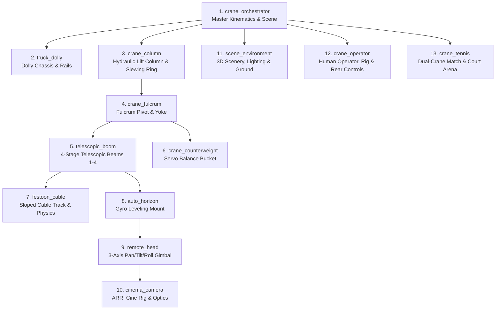

# Supertechno 50 3D Crane – Multi-Agent System (AGENTS.md)

Dieses Dokument definiert das modulare Multi-Agenten-System für die 3D-Simulation und Kinematik des **Supertechno 50 Teleskopkrans**.
Jede physikalische und logische Baugruppe des Krans wird von einem spezialisierten Agenten überwacht und weiterentwickelt.

---

## 🤖 Übersicht der Kran-Spezialagenten

---

## 📋 Komponenten & Agenten-Spezifikationen

### 1. `crane_orchestrator` (Master Kinematics & Scene Orchestrator)
* **Dateien**: [`src/components/Crane.tsx`](file:///e:/3D-headings/src/components/Crane.tsx), [`src/utils/craneKinematics.ts`](file:///e:/3D-headings/src/utils/craneKinematics.ts), [`src/App.tsx`](file:///e:/3D-headings/src/App.tsx)
* **Zuständigkeit**:
  * Gesamtszenen-Management (R3F Canvas, Beleuchtung, Umgebungs-Presets, Kameras).
  * Kinematische Guardrails (`SAFE_FLOOR_CLEARANCE = 0.05m`, `enforceCraneFloorLimits`).
  * Globale Parameter-Synchronisation: `dollyTrack`, `columnLift`, `basePan`, `boomTilt`, `teleExtension`, `headPan`, `headTilt`, `headRoll`.
  * HUD- und Telemetrie-Rendering (Ausfahrlänge, Neigungswinkel, Linsenhöhe über Grund, Bodenabstand).

### 2. `truck_dolly` (Dolly Chassis & Schienen)
* **Dateien**: [`src/components/Truck.tsx`](file:///e:/3D-headings/src/components/Truck.tsx)
* **Zuständigkeit**:
  * Mobiles Chassis, 4x Doppel-Stahl-Schienenräder, Luftreifen für Studiobetrieb.
  * Hydraulische Nivellierstützen (Outriggers) und Wasserwaagen-Anzeigen.
  * Schienenführung (`CraneDollyRailTrack`), Schienenlänge, Anschlagpuffer.

### 3. `crane_column` (Hubsäule & Schwenklager)
* **Dateien**: [`src/components/CraneColumnAssembly.tsx`](file:///e:/3D-headings/src/components/CraneColumnAssembly.tsx)
* **Zuständigkeit**:
  * Teleskopierbare hydraulische Hubsäule (Zylinderstufe 1 & 2).
  * 360° Kugeldrehverbindung (Base Pan Slewing Ring).
  * Hubkinematik-Grenzen (`getMinColumnElevationForPose`, `clampColumnElevation`).

### 4. `crane_fulcrum` (Fulcrum / Hauptgelenk & Yoke)
* **Dateien**: [`src/components/CraneFulcrumAssembly.tsx`](file:///e:/3D-headings/src/components/CraneFulcrumAssembly.tsx)
* **Zuständigkeit**:
  * Hauptlager-Gabel (Yoke) aus eloxiertem Aluminium/Stahl.
  * Neigeachse (`boomTilt`), Dämpferzylinder, Drehwinkel-Encoder.
  * Mechanische Endanschläge (-45° bis +60°).

### 5. `telescopic_boom` (Teleskop-Ausleger Beams 1-4)
* **Dateien**: [`src/components/Crane.tsx`](file:///e:/3D-headings/src/components/Crane.tsx), [`src/model/Supertechno50FBXModel.ts`](file:///e:/3D-headings/src/model/Supertechno50FBXModel.ts)
* **Zuständigkeit**:
  * 4-stufiger synchroner Teleskoparm (Beam 1 außen bis Beam 4 innen + Nase).
  * Interne Edelstahl-Antriebsseile, Umlenkrollen, spielfreie Linearführungen.
  * Ausfahrbereich: 0.0 m bis ~11.5 m (maximale Gesamtreichweite ~15.2 m).

### 6. `crane_counterweight` (Gegengewicht & Massenbalance)
* **Dateien**: [`src/components/CraneCounterweight.tsx`](file:///e:/3D-headings/src/components/CraneCounterweight.tsx)
* **Zuständigkeit**:
  * Heck-Gegengewichtswagen mit Bleigewichten und Spindelantrieb.
  * Automatische synchrone Massenkompensation bei Ausfahren des Teleskoparms.
  * Heck-Bodenkollisionsüberwachung (`getRearLowestY`).
  * Endanschlag und Führungsschienenbereich ($z = -1.08\,\text{m}$ bis $+3.48\,\text{m}$, Schlittenfahrt $z = -0.80\,\text{m}$ bis $+3.28\,\text{m}$).

### 7. `festoon_cable` (Schleppkabel & Festoon-Dynamik)
* **Dateien**: [`src/components/SlopeCable.tsx`](file:///e:/3D-headings/src/components/SlopeCable.tsx), `CraneFestoonCable` in [`src/components/Crane.tsx`](file:///e:/3D-headings/src/components/Crane.tsx)
* **Zuständigkeit**:
  * Geneigte Kabelführung (Festoon Track) entlang der Teleskopstufen.
  * Dynamische Katenoid-/Bézier-Durchhangsberechnung (`sagFactor`, Schlaufenanzahl).
  * PBR-Kabelmaterialien (schwarzer Mattgummi, Kupfer/Stahl-Geflecht, farbige SDI-Leitungen).
  * **Kabel-Startregel (Supremacy / Guardrail)**: Das Schleppkabel und dessen Führungsschiene dürfen IMMER erst NACH den Gegengewichten beginnen (in Ausfahrrichtung des Auslegers, $z \le -1.18\,\text{m}$), sodass Kabel und Verfahrweg des Gegengewichtswagens vollständig kollisionsfrei getrennt sind.

### 8. `auto_horizon` (Auto-Horizon Nivellierung)
* **Dateien**: [`src/components/AutoHorizonMount.tsx`](file:///e:/3D-headings/src/components/AutoHorizonMount.tsx)
* **Zuständigkeit**:
  * Frontflansch mit "Supertechno"-Lasergravur.
  * Elektronischer Gyro-Horizontausgleich (2-Achs Neigungs- & Rollkompensation).
  * Standardisierte Mitchell-Mount-Basis mit Schlossmutter.

### 9. `remote_head` (3-Achs Remote Camera Head)
* **Dateien**: [`src/components/RemoteCameraHead.tsx`](file:///e:/3D-headings/src/components/RemoteCameraHead.tsx)
* **Zuständigkeit**:
  * 3-Achsen Gimbal (Pan, Tilt, Roll) mit Brushless-Direktantrieben.
  * Optische Absolutwertgeber, Schleifringe für kontinuierliche 360°-Drehungen.
  * Kamerawippe mit Dovetail-Schnellwechselplatte.

### 10. `cinema_camera` (ARRI Cinema Kamera Rig)
* **Dateien**: [`src/components/ArriCinemaCamera.tsx`](file:///e:/3D-headings/src/components/ArriCinemaCamera.tsx)
* **Zuständigkeit**:
  * ARRI Alexa Mini LF Kameragehäuse mit Cine-Objektiv und Antireflex-Frontlinse.
  * Carbon-Rohre (15mm/19mm), Cforce-Motoren für Focus/Iris/Zoom, Mattebox mit Flags.
  * Funk-Bildsender (Teradek), V-Mount Akkus und Sensorebenen-Projektion.

### 11. `scene_environment` (3D Scenery, Environment & Ground Manager)
* **Dateien**: [`src/components/CraneScenery.tsx`](file:///e:/3D-headings/src/components/CraneScenery.tsx), [`src/components/Crane.tsx`](file:///e:/3D-headings/src/components/Crane.tsx)
* **Zuständigkeit**:
  * Helle & dunkle 3D-Standorte: Heller Platz & Pyramiden (`bright_concrete`), Gizeh Pyramiden Wüste (`pyramids`), Machu Picchu Inka-Anden (`machu_picchu`), Helle Sommerwiese (`bright_meadow`), High-Key Studio (`bright_studio`), Grüne Wiese (`meadow`), Industrie-Beton (`concrete`), Seeufer (`lake`), Dark Studio (`studio`).
  * 3D-Hintergrund-Monumente: Monumentale Pyramiden von Gizeh (Cheops, Chephren, Mykerinos, Sphinx), Inka-Zitadelle Machu Picchu (Zuckerhut-Gipfel Huayna Picchu, Andenes-Terrassen, Sonnentempel, Intihuatana, Inka-Steinhäuser und grasende Lamas).
  * Fotorealistische Sonnen- und Himmelsausleuchtung, Sky-Fill-Lichter, Kontakt- & Weichschatten, atmosphärischer SkyDome mit Wolkendynamik.
  * Prozedurale PBR-Bodentexturen (Sichtbeton, Wüstensand-Rippeln, Andengras, Grasnarben, Wildblumen, Steine, Holzdielen, Poller, Schiffscontainer).
  * Synchronisation von Hintergrundfarben und HDRI-Presets (`city`, `park`, `studio`, `sunset`).

### 12. `crane_operator` (Film Set Two-Operator Crew & Controls Master)
* **Dateien**: [`src/components/CraneOperator.tsx`](file:///e:/3D-headings/src/components/CraneOperator.tsx), [`src/components/Crane.tsx`](file:///e:/3D-headings/src/components/Crane.tsx)
* **Zuständigkeit**:
  * **1. Heck-Kranführer (Rear Crane Operator)**:
    * 3D-Charakter-Rig mit Vintage "SUPERTECHNO CINE CRANE OPS" Trucker-Cap, Salt-&-Pepper Haar/Vollbart, In-Ear-Akustik-Spiralschlauch, Outdoor-Setjacke und Grip-Handschuhen.
    * Steht direkt am Heck-Steuerpult hinter den Gegengewichten ($X=0\,\text{m}, Z=\text{dollyTrack}+4.1\,\text{m}$).
    * Live-Synchronisation der goldenen Fluid-Handräder (`basePan`, `boomTilt`) und des Teleskop-Joysticks (`teleExtension`).
    * Dynamisches Kopf-Tracking (schaut hinauf zur Kranspitze / Linsenhöhe).
    * Kamera-Fokus & Close-Up-Zoom (`case 'operator'`).
  * **2. DoP / Remote-Head Operator am Bodenpult (Floor Desk Operator)**:
    * 3D-Charakter-Rig mit Film-Crew Hoodie/Shirt ("TECHNOCRANE HEAD & MOCO OPERATOR"), Pro Cine-Headset mit Boom-Mikrofon.
    * Steht am separaten Flightcase-Bodensteuerpult neben der Schiene ($X=3.2\,\text{m}, Z=\text{dollyTrack}+0.8\,\text{m}$).
    * Steuert 3x Master Wheels (`headPan`, `headTilt`, `headRoll`) und FIZ-Kamerasteuerung.
    * Flightcase-Steuerpult mit Stativ, 17" ARRI Live-Master-Monitor (Frame Guides, Waveform, TC), 7" Zusatzmonitor und Snake-Bodenkabel.
    * Kamera-Fokus & Close-Up-Zoom (`case 'desk'`).
  * **3. Synchronisierte Walk-In/Walk-Out-Kinematik**:
    * Beide Operatoren laufen bei Aktivierung zeitgleich von ihren Staging-Positionen flüssig an ihre jeweiligen Pulte und verlassen diese bei Deaktivierung.

### 13. `crane_tennis` (Dual-Crane Tennis Match, Arena & Broadcast Director)
* **Dateien**: [`src/components/CraneTennis.tsx`](file:///e:/3D-headings/src/components/CraneTennis.tsx), [`src/model/Supertechno50FBXModel.ts`](file:///e:/3D-headings/src/model/Supertechno50FBXModel.ts), [`src/components/RemoteCameraHead.tsx`](file:///e:/3D-headings/src/components/RemoteCameraHead.tsx)
* **Zuständigkeit**:
  * **Dual-Kran Match Kinematik**: 2 synchrone Supertechno 50 Kräne auf parallelen Grundlinien-Schienen ($Z = -15.2\,\text{m}$ und $+15.2\,\text{m}$) mit dynamischer Inverse Kinematik (IK) für Vorhand, Rückhand, Slice, Topspin, 228 km/h Power-Aufschläge sowie **248 km/h Monster-Smashes & Netz-Volleys** direkt am Netz ($Z \approx \pm 1.8\,\text{m} \dots \pm 3.8\,\text{m}$, Auslegervorschub bis zu 11.2m).
  * **Carbon-Tennisschläger als Kamera-Payload (`CraneTennisRacket`)**: In diesem Tennis-View ist die Kamera im Remote Head der Tennisschläger selbst (`customPayload` in `RemoteCameraHead`). Der Kohlefaser-Schlägerkopf sitzt direkt auf dem Gimbal-Kameraträger mit Gitterbespannung, Griffband, kinetischem Saiten-Glow und Partikel-Burst am Sweet Spot.
  * **Ball-Physik & Flugkurven-Engine (`RallyShot`)**: 3D parabolische Trajektorien, Netzhöhenberechnung ($Y_{\text{net}} \approx 1.3 - 11.2\,\text{m}$), **1. & 2. Aufschlag-Dynamik mit Ball-Dribbelphase am Boden**, Schiedsrichter-Faults und realistischer Pause vor dem 2. Service, **10.5m Topspin-Lob Winner** über den Ausleger am Netz, **11.2m hohe defensive Sky-Notkerze** mit Schmetterball-Abschlag, **authentische Netzfehler (`isNetError`) mit Abprall an der Netzkante und Bodenfall an der Netzbasis**, **Out-Bälle (`isOutError`)** und **Netzroller-Drama (`isNetCord`)**, Ball-Smash-Glow, Plasma-Doppelring-Boden-Schockwellen (`smashBurst`) und explosive Rebound-Kicks über die Stadionwand.
  * **World #1 vs World #2 Match Simulation & H2H Engine**: Reales ATP-Finale zwischen 🇮🇹 **[1] Jannik Sinner** (132 km/h Rückhand-Laser, 234 km/h Flat-Aufschlag) und 🇪🇸 **[2] Carlos Alcaraz** (3.200 RPM Heavy Topspin, Disguised Stoppbälle, 248 km/h Smashes) mit offiziellem H2H-Stats-Modal (Alcaraz führt 10–7, Fehlerquoten: ~32% Unforced/Forced Errors).
  * **Grand Slam Match Engine & Schiedsrichter (`TennisUmpire`, `MatchScore`)**: Vollständiges Tennis-Punktesystem (Love, 15, 30, 40, Deuce, Advantage, Game, Set, Tiebreak) mit 3D-animiertem Chair Umpire (Live-Kopf-Tracking und akustisch-visuelle Durchsagen).
  * **Courtside Staff & Tribünen-Atmosphäre**: 4x Ballkinder, 6x Linienrichter mit Signalflaggen, Grand-Stand Tribünen mit 3D-Zuschauern und La-Ola-Jubel.
  * **Grand Slam Court Arena (`TennisCourtArena`)**: 4 umschaltbare PBR-Beläge (Sandplatz/Clay, Rasen/Grass, Hartplatz/Hardcourt, Cyber Neon/Cyber), weiße Markierungslinien, Turniertennisnetz mit Pfosten, LED-Sponsorbanden und 4x Flutlichtmasten.
  * **TV Broadcast Regie & Scoreboard (`TennisCameraMode`)**: 8 dynamische Kameraperspektiven (`broadcast`, `smash` [exklusive First-Person Tennisschläger-Kamera], `ball`, `crane1`, `umpire`, `spectator`, `coach`, `free`) und TV-Grafik-Scoreboard mit Radar-Geschwindigkeitsanzeige, `🔥 248 km/h SMASH`-, `⚡ NETZ-VOLLEY`-, `🕸️ NETZFEHLER`- und `⚠️ OUT`-Status-Badges.
  * **Emotionen & Körpersprache zwischen den Ballwechseln (`celebrationTimerRef`)**: 2.4s authentische Gesten nach jedem Punkt: 🇮🇹 Sinner mit ruhigem, fokussiertem Nicken & Steely Fist, 🇪🇸 Alcaraz mit explosivem 34° Vamos-Ausleger, Faustpumpen und 360° Racket-Twirl; Verlierer mit ungläubigem links-rechts Kopfschütteln & Blick zum Himmel; Vor-Aufschlag-Rituale mit Ball-Dribbeln, Saitenzupfen und Receiver im federnden Ready-Stance.

---

## ⚡ Workflow-Protokoll

Jede Modifikation an einer Kran-Komponente wird vom jeweiligen Spezial-Agenten ausgeführt und anschließend vom `crane_orchestrator` validiert:
1. **Komponenten-Isolierung**: Änderungen an Geometrie/Shader/Physik werden in der zuständigen Datei durchgeführt.
2. **Kinematik-Konsistenz**: Keine Komponente darf die definierten mechanischen Grenzwerte verletzen.
3. **Boden- & Kollisionsschutz**: Der Sicherheitsabstand (`SAFE_FLOOR_CLEARANCE`) bleibt unter allen Neigungs- und Hubkonfigurationen garantiert.
