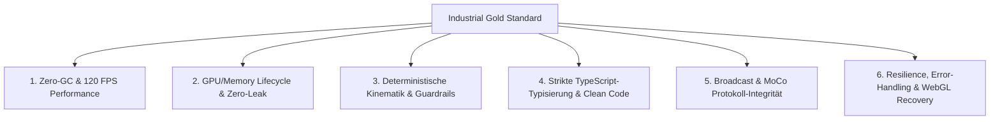

# Industrial Gold Standard & Senior Architecture Guidelines
## Supertechno 50 3D Simulation & Realtime Kinematics Engine

Dieses Dokument definiert die verbindlichen Entwicklungs-, Performance- und Architektur-Regeln für das gesamte Projekt. Als **Senior Developer & Software Architect** unterliegt jede Code-Änderung diesen Standards.

---

## 🏛️ Die 6 Säulen des Industrial Gold Standards



---

## ⚡ Säule 1: R3F & Three.js Realtime Performance (Zero-GC & 120 FPS)

### 1.1 Zero Allocations im Render-Loop (`useFrame`)
* **Verbot**: Es dürfen NIEMALS `new THREE.Vector3()`, `new THREE.Quaternion()`, `new THREE.Matrix4()`, `new THREE.Euler()`, `new THREE.Color()` oder temporäre Arrays/Objekte innerhalb von `useFrame` oder Animations-Schleifen instanziiert werden.
* **Grund**: Vermeidung von V8 Garbage Collection Spikes (Mikro-Ruckler / Frame Drops).
* **Industrial Standard**:
  ```typescript
  // ❌ VERBOTEN: Garbage Collection Druck
  useFrame(() => {
    const tempPos = new THREE.Vector3(x, y, z);
    meshRef.current.position.copy(tempPos);
  });

  // ✅ INDUSTRIAL GOLD STANDARD: Scratch / Temp-Objekte auf Modul-Ebene
  const _v1 = new THREE.Vector3();
  const _q1 = new THREE.Quaternion();

  useFrame((_, dt) => {
    _v1.set(x, y, z);
    meshRef.current.position.copy(_v1);
  });
  ```

### 1.2 Framerate-Unabhängige Dämpfung (Damp & Exp-Lerp)
* **Verbot**: Reines lineares Lerpen mit statischem `dt * factor` (`lerp(a, b, dt * 10)`), da dieses bei schwankenden Bildwiederholraten (30 Hz vs. 60 Hz vs. 120 Hz vs. 144 Hz) unterschiedlich schnell konvergiert.
* **Industrial Standard**:
  Verwendung von exponentieller Dämpfung (`damp` / `1 - Math.exp(-lambda * dt)`):
  ```typescript
  // Exakt framerate-unabhängige Dämpfung
  export function dampExp(current: number, target: number, lambda: number, dt: number): number {
    return THREE.MathUtils.lerp(current, target, 1 - Math.exp(-lambda * dt));
  }
  ```

### 1.3 State-Entkopplung: React State vs. Direct Ref Mutating
* **Regel**: Hochfrequente Transformationen (Positionen, Rotationen, Kinematik-Winkel bei 60/120 Hz) dürfen NIEMALS über React State (`useState`) gerendert werden.
* **Industrial Standard**:
  * **React State (`useState` / Context)**: Ausschließlich für niederfrequente UI-Zustände (Preset-Wechsel, Kamera-Modus, Scoreboard-Punkte, Einstellungen).
  * **Direct Ref Mutation**: Für alle Echtzeit-Kinematik-Pfade via `meshRef.current.position` / `rotation` in `useFrame`.

### 1.4 Batching & InstancedMesh
* Sich wiederholende Geometrien (z.B. Schienen-Schwellen, Bolzen, Stadion-Zuschauer, Kabel-Segmente, Saiten-Gitter) MÜSSEN als `InstancedMesh` oder zusammengeführte Geometrien (`BufferGeometryUtils.mergeGeometries`) ausgeführt werden. Max. 100 Draw Calls pro Frame als Obergrenze.

---

## 🧹 Säule 2: GPU- & Memory-Lifecycle (Zero-Leak Policy)

### 2.1 Explizites GPU-Resource Disposing
* Jede dynamisch erzeugte Three.js-Ressource (Geometrien, Materialien, Texturen, WebGLRenderTargets, Canvas-Texturen) MUSS beim Unmounten explizit freigegeben werden:
  ```typescript
  useEffect(() => {
    return () => {
      geometry.dispose();
      if (Array.isArray(material)) {
        material.forEach(m => m.dispose());
      } else {
        material.dispose();
      }
      texture?.dispose();
    };
  }, []);
  ```

### 2.2 Texture Pooling & Dynamic Canvas Caching
* Dynamische Texturen (wie die 1024x512 Scoreboard-Canvas oder der 17" ARRI Master-Viewfinder) dürfen nicht in jedem Frame neu erzeugt werden. Stattdessen wird ein statisches Canvas im Speicher gehalten und ausschließlich via `texture.needsUpdate = true` aktualisiert, wenn sich Daten tatsächlich geändert haben (*Dirty-Flag-Pattern*).

---

## 📐 Säule 3: Deterministische Kinematik & Guardrail Governance

### 3.1 Pure Function Determinismus in `src/utils/`
* Alle mathematischen Kinematik-Berechnungen (Inverse Kinematik, Vorwärtskinematik, Ballistik-Trajektorien, Dämpfungs-Algorithmen) MÜSSEN als **Pure Functions** ohne globale Seiteneffekte implementiert sein.
* Gegebene Posen-Inputs müssen unter allen Bedingungen exakt denselben Output liefern (deterministisch & unit-testbar).

### 3.2 Unumstößliche Sicherheits-Guardrails (Supremacy-Regeln)
1. **Bodenabstand (`SAFE_FLOOR_CLEARANCE = 0.05m`)**:
   * Kein Teil des Krans, des Remote Heads, der Kamera oder des Gegengewichts darf unter $Y = +0.05\,\text{m}$ fallen.
   * Bei tiefen Winkeln greift die automatische Hubbegrenzung (`enforceCraneFloorLimits`).
2. **Kabel-Startregel**:
   * Das Schleppkabel beginnt IMMER erst NACH den Gegengewichten in Ausfahrrichtung ($z \le -1.18\,\text{m}$), sodass der Verfahrweg des Gegengewichtswagens ($z = -0.80\,\text{m}$ bis $+3.28\,\text{m}$) kollisionsfrei bleibt.
3. **Tennis Kinematik Guardrails**:
   * Schläger-Bodenabstand `RACKET_SAFE_FLOOR_CLEARANCE = 0.12m`.
   * Netz-Sicherheitszone `NET_SAFETY_BUFFER_Z = 0.45m`.
   * Schienen-Endanschläge bei $X = \pm 7.5\,\text{m}$ mit sanfter Endlagendämpfung.

---

## 💎 Säule 4: Strikte TypeScript-Typisierung & Clean Code

### 4.1 Zero-`any`-Regel
* Die Verwendung von `any` oder unbegründeten Casts (`as unknown as T`) ist in geschäftskritischen Kinematik-, Protokoll- und Komponenten-Dateien strikt untersagt.
* Alle Typen, Schnittstellen und Payloads müssen vollständig typisiert sein:
  ```typescript
  // ❌ VERBOTEN
  function updateRig(data: any) { ... }

  // ✅ INDUSTRIAL GOLD STANDARD
  interface CranePoseConfig {
    readonly dollyTrack: number;
    readonly columnElevation: number;
    readonly basePan: number;
    readonly boomTilt: number;
    readonly teleExtension: number;
    readonly headPan: number;
    readonly headTilt: number;
    readonly headRoll: number;
  }
  ```

### 4.2 Single Responsibility Principle (SRP) & Modul-Größe
* Komponenten mit mehr als 1.500 Zeilen MÜSSEN systematisch in logische Sub-Assemblies zerlegt werden (z.B. `CraneColumnAssembly`, `CraneFulcrumAssembly`, `CraneCounterweight`, `CraneTennisRacketHead`).
* Präsentations-Code (JSX), mathematische Kinematik (`src/utils/`) und Datenmodelle (`src/model/`) sind strikt getrennt.

---

## 📡 Säule 5: Broadcast- & Protokoll-Integrität

### 5.1 SMPTE Frame-Accurate Timecode
* Alle Tracking-Streams, MoCo-Keyframes und Event-Trigger müssen exakt an den SMPTE-Timecode (`HH:MM:SS:FF`) gekoppelt sein (unterstützte Frameraten: 24, 25, 29.97, 30, 50, 60 fps).

### 5.2 Header- & Checksum-Validierung
* Alle Technocrane MoCo-Datenpakete müssen den Magic Header `0x7F7A5AA5` sowie vollständige 6-DOF kartesische Koordinaten und FIZ-Objektivdaten (Focus, Iris, Zoom) validieren, bevor sie an Zielsysteme (Unreal Engine / Maya / Disguise) gestreamt werden.

---

## 🛡️ Säule 6: Resilience, Error-Handling & WebGL Recovery

### 6.1 Error Boundaries & Graceful Degradation
* Kritische 3D-Baugruppen müssen in [`ErrorBoundary.tsx`](file:///e:/3D-headings/src/components/ErrorBoundary.tsx) gekapselt sein. Ein Fehler in einer Shader-Berechnung oder einem Asset darf niemals die gesamte Anwendung zum Absturz bringen.
* Bei Ausfall externer 3D-Modelle (z.B. FBX-Dateien) greift automatisch ein prozedurales 3D-Geometrie-Fallback.

### 6.2 WebGL Context Loss Handling
* Listener für `webglcontextlost` und `webglcontextrestored` müssen registriert sein, um Render-Schleifen sauber zu pausieren und Texturen/Shader nach Wiederherstellung des Kontexts automatisch neu zu binden.

---

## 📋 Checkliste für Code-Reviews (Senior Architect Sign-off)

Jeder Pull Request bzw. jede Code-Änderung muss folgende Kriterien erfüllen:

- [ ] **Build-Test**: `npm run build` (`tsc -b && vite build`) kompiliert mit 0 Fehlern und 0 Typ-Warnungen.
- [ ] **Zero-Allocation**: Keine Objekterzeugungen in `useFrame`-Schleifen.
- [ ] **Resource Disposal**: Alle neu hinzugefügten Geometrien/Texturen/Materialien besitzen Dispose-Hooks.
- [ ] **Guardrails**: Alle Kinematik-Werte halten die physikalischen Grenzwerte und Bodenabstände ein.
- [ ] **Framerate Independence**: Alle Interpolationen nutzen exponentielle Dämpfung oder `dt`-skalierte Schritte.
- [ ] **Modul-Dokumentation**: Änderungen sind im jeweiligen Spezial-Agenten in `AGENTS.md` und `.agents/crane/` dokumentiert.
